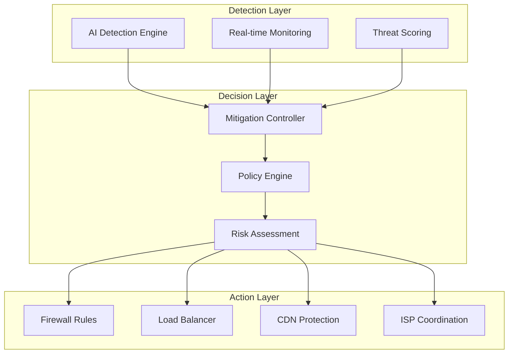

# DDoS.AI Platform: Complete Setup & Usage Guide

## 🚀 Quick Overview

DDoS.AI is an advanced AI-powered platform for detecting and analyzing DDoS attacks in real-time. This comprehensive guide covers everything from basic setup to advanced cross-device attack testing and AI model training.

**Current Phase**: Detection & Analysis | **Next Phase**: Mitigation & Prevention

## � Quick Navigation Index

| #   | Topic                    | Description                     | Link                                                   |
| --- | ------------------------ | ------------------------------- | ------------------------------------------------------ |
| 1   | **Platform Setup**       | Basic installation and startup  | [→ Setup Guide](#1-platform-setup)                     |
| 2   | **Cross-Device Testing** | Real attack testing between PCs | [→ Cross-Device Guide](#2-cross-device-attack-testing) |
| 3   | **AI Model Training**    | Train custom detection models   | [→ Training Guide](#3-ai-model-training)               |
| 4   | **Attack Simulation**    | Generate and test attacks       | [→ Simulation Guide](#4-attack-simulation)             |
| 5   | **Dashboard Usage**      | Navigate the web interface      | [→ Dashboard Guide](#5-dashboard-usage)                |
| 6   | **Network Monitoring**   | Real-time traffic analysis      | [→ Monitoring Guide](#6-network-monitoring)            |
| 7   | **API Integration**      | Programmatic access             | [→ API Guide](#7-api-integration)                      |
| 8   | **Deployment**           | Production deployment           | [→ Deployment Guide](#8-production-deployment)         |
| 9   | **Troubleshooting**      | Common issues and fixes         | [→ Troubleshooting](#9-troubleshooting)                |
| 10  | **Advanced Features**    | Custom configurations           | [→ Advanced Guide](#10-advanced-features)              |

---

## 1. Platform Setup

### Prerequisites

- **OS**: Windows 10+, Ubuntu 18.04+, macOS 10.15+
- **RAM**: 8GB minimum (16GB recommended)
- **CPU**: 4 cores minimum (8 cores recommended)
- **Storage**: 20GB free space
- **Software**: Docker & Docker Compose, Python 3.9+, Node.js 18+

### Quick Start Options

#### Option A: Docker (Recommended)

```bash
# Clone repository
git clone https://github.com/AskitEndo/DDOSai_v2.git
cd DDOSai_v2

# Windows - Start development environment
.\run_dev.bat

# Linux/macOS - Start development environment
chmod +x run_dev.sh && ./run_dev.sh
```

#### Option B: Manual Installation

```bash
# Backend setup
cd backend
python -m venv venv
venv\Scripts\activate  # Windows
source venv/bin/activate  # Linux/macOS
pip install -r requirements.txt
uvicorn main:app --host 0.0.0.0 --port 8000 --reload

# Frontend setup (new terminal)
cd frontend
npm install
npm run dev
```

### Access Points

- **Dashboard**: http://localhost:3000
- **API Docs**: http://localhost:8000/docs
- **Grafana**: http://localhost:3001
- **Prometheus**: http://localhost:9090

---

## 2. Cross-Device Attack Testing

### Overview

Test real DDoS attacks between multiple machines on the same network. PC A generates attacks while PC B serves as the target, with real-time monitoring on both ends.

### Setup Process

#### Step 1: Prepare Target Machine (PC B)

```bash
# On target machine
cd backend
.\start_target_server.bat   # Windows
./start_target_server.sh    # Linux/macOS

# Verify target server (should show stats)
curl http://[TARGET_IP]:8080/stats
```

#### Step 2: Configure Attack Machine (PC A)

```bash
# Start main platform
.\run_dev.bat

# Access dashboard
# Go to: http://localhost:3000
```

#### Step 3: Configure Cross-Device Attack

1. Open dashboard on PC A
2. Click "Load from Backend" to initialize
3. Start "Network Monitoring" panel
4. Navigate to "Simulation" tab
5. Enter PC B's IP address as target
6. Select attack type (SYN Flood, UDP Flood, HTTP Flood)
7. Configure packet rate and duration
8. Launch attack

#### Step 4: Monitor Real Impact

- **PC A**: Watch outgoing traffic in Network Monitoring panel
- **PC B**: Monitor target server logs and system resources
- **Both**: Observe actual network activity in Task Manager

### Attack Verification

- Dashboard shows real network statistics using `psutil`
- Target server displays incoming request counts
- Task Manager shows actual network spikes on both machines
- WebSocket updates provide real-time cross-device notifications

---

## 3. AI Model Training & Data Management

### Available Models & Training Capabilities

#### 1. **Autoencoder** (Anomaly Detection - 99.2% Accuracy)

- **Purpose**: Detects anomalies based on reconstruction error
- **Training Type**: Unsupervised learning on normal traffic patterns
- **Features**: Uses 31 packet-level features
- **Architecture**: Encoder-Decoder with hidden layers [64, 32, 16, 32, 64]

#### 2. **Graph Neural Network (GNN)** (Network Topology Analysis)

- **Purpose**: Analyzes network graph structure for malicious nodes
- **Training Type**: Supervised learning on network flow patterns
- **Features**: Node features, edge weights, graph topology
- **Architecture**: Multi-layer GNN with attention mechanism

#### 3. **Reinforcement Learning (RL)** (Adaptive Threat Scoring)

- **Purpose**: Assigns dynamic threat scores based on learned patterns
- **Training Type**: RL with experience replay and Q-learning
- **Features**: State-action-reward learning from attack patterns
- **Architecture**: Deep Q-Network (DQN) with target network

#### 4. **Consensus Engine** (Combined Model Decisions)

- **Purpose**: Combines all model outputs for final decision
- **Training Type**: Weighted voting system
- **Features**: Model confidence scores, historical performance
- **Architecture**: Ensemble method with adaptive weights

### Training with Different Attack Types

#### Current Supported Attack Types for Training:

1. **SYN Flood**: TCP connection exhaustion attacks
2. **UDP Flood**: Bandwidth consumption attacks
3. **HTTP Flood**: Application layer overload attacks
4. **Slowloris**: Connection pool exhaustion
5. **DNS Amplification**: Reflection and amplification attacks
6. **Port Scanning**: Network reconnaissance attacks
7. **Distributed Attacks**: Multi-source coordinated attacks
8. **Mixed Attacks**: Combination of multiple attack types

#### Adding New Attack Types:

**1. Collect Attack Data:**

```bash
# Capture real attack traffic
python -m backend.ingestion.pcap_ingestor \
  --input new_attack_traffic.pcap \
  --output data/new_attack_data.json \
  --attack-type CUSTOM_ATTACK

# Import from CSV format
python -m backend.ingestion.csv_ingestor \
  --input attack_logs.csv \
  --output data/processed_attack.json \
  --label-column "is_malicious"
```

**2. Feature Engineering:**

```bash
# Extract features from new attack data
python -m backend.core.feature_extractor \
  --input data/new_attack_data.json \
  --output data/attack_features.csv \
  --feature-set extended  # Uses all 31+ features
```

**3. Train Models with New Data:**

```bash
# Train all models with new attack patterns
python -m backend.ai.train_models \
  --dataset data/attack_features.csv \
  --model all \
  --attack-types SYN_FLOOD,UDP_FLOOD,CUSTOM_ATTACK \
  --epochs 200 \
  --validation-split 0.2
```

### Data Sources & Formats

#### 1. **Network Capture Data**

```bash
# Live network capture
python -m backend.ingestion.live_ingestor \
  --interface eth0 \
  --duration 3600 \
  --output live_traffic.json

# PCAP file processing
python -m backend.ingestion.pcap_ingestor \
  --input captured_traffic.pcap \
  --output processed_traffic.json
```

#### 2. **Log File Data**

```bash
# Import from various log formats
python -m backend.ingestion.log_ingestor \
  --input /var/log/network.log \
  --format syslog \
  --output network_data.json

# Firewall logs
python -m backend.ingestion.log_ingestor \
  --input firewall.log \
  --format iptables \
  --output firewall_data.json
```

#### 3. **CSV Feature Data**

```csv
# Required CSV format for training:
timestamp,src_ip,dst_ip,src_port,dst_port,protocol,packet_size,ttl,flags,payload_entropy,label
2023-01-15T10:00:01.123,192.168.1.100,10.0.0.1,12345,80,TCP,64,64,SYN,0.75,0
2023-01-15T10:00:01.234,203.0.113.1,10.0.0.1,12345,80,TCP,64,32,SYN,0.1,1
```

#### 4. **Real-Time Internet Data**

```bash
# Download public datasets
python -m backend.tools.dataset_downloader \
  --dataset CICIDS2017 \
  --output data/public_datasets/

# Process downloaded datasets
python -m backend.tools.dataset_processor \
  --input data/public_datasets/CICIDS2017 \
  --output data/processed_cicids.json \
  --normalize true
```

### Advanced Training Features

#### 1. **Custom Model Training**

```python
# Create custom detector
from backend.ai.base_detector import BaseDetector

class CustomAttackDetector(BaseDetector):
    def __init__(self):
        super().__init__("CustomDetector", "1.0.0")

    def train(self, data, labels):
        # Custom training logic for specific attack types
        # Example: CNN for packet sequence analysis
        pass

    def predict(self, features):
        # Custom prediction logic
        return is_malicious, confidence, explanation

# Register and train custom model
detector = CustomAttackDetector()
detector.train(training_data, labels)
```

#### 2. **Transfer Learning**

```bash
# Use pre-trained models and fine-tune
python -m backend.ai.transfer_learning \
  --base-model autoencoder_pretrained.pth \
  --new-data specialized_attack_data.json \
  --fine-tune-epochs 50 \
  --output specialized_model.pth
```

#### 3. **Federated Learning**

```bash
# Train with data from multiple sources without sharing raw data
python -m backend.ai.federated_training \
  --nodes node1_data.json,node2_data.json,node3_data.json \
  --rounds 10 \
  --aggregation weighted_average
```

### Model Performance & Optimization

#### 1. **Hyperparameter Tuning**

```bash
# Automated hyperparameter optimization
python -m backend.ai.hyperparameter_tuning \
  --model autoencoder \
  --dataset training_data.csv \
  --trials 100 \
  --optimization-metric f1_score
```

#### 2. **Cross-Validation Training**

```bash
# K-fold cross-validation
python -m backend.ai.cross_validation \
  --dataset mixed_attacks.json \
  --folds 5 \
  --models autoencoder,gnn,rl \
  --metrics accuracy,precision,recall,f1
```

#### 3. **Model Ensemble Training**

```bash
# Train ensemble of models
python -m backend.ai.ensemble_training \
  --base-models autoencoder,gnn,rl \
  --ensemble-method stacking \
  --meta-learner xgboost \
  --output ensemble_model.pkl
```

### Data Pipeline & Preprocessing

#### 1. **Feature Engineering Pipeline**

```bash
# Create comprehensive feature extraction pipeline
python -m backend.core.feature_pipeline \
  --input raw_traffic.json \
  --steps normalize,scale,encode,select \
  --output processed_features.csv
```

#### 2. **Data Augmentation**

```bash
# Generate synthetic attack data for training
python -m backend.tools.data_augmentation \
  --base-attacks syn_flood.json \
  --augmentation-factor 5 \
  --techniques noise,rotation,scaling \
  --output augmented_data.json
```

#### 3. **Real-Time Training Pipeline**

```bash
# Continuous learning from live traffic
python -m backend.ai.online_learning \
  --model autoencoder \
  --stream-source network_interface \
  --update-frequency 3600 \  # Update every hour
  --batch-size 1000
```

### Training Data Quality & Validation

#### 1. **Data Quality Assessment**

```bash
# Analyze training data quality
python -m backend.tools.data_quality \
  --dataset training_data.csv \
  --checks completeness,accuracy,consistency \
  --output quality_report.json
```

#### 2. **Bias Detection & Mitigation**

```bash
# Check for training bias
python -m backend.tools.bias_detection \
  --dataset training_data.csv \
  --protected-attributes src_ip,protocol \
  --output bias_report.json
```

#### 3. **Data Drift Monitoring**

```bash
# Monitor for distribution changes in production
python -m backend.monitoring.data_drift \
  --reference-data training_data.csv \
  --production-data live_traffic.json \
  --alert-threshold 0.1
```

---

## 4. Attack Simulation

### Supported Attack Types

1. **SYN Flood**: TCP connection exhaustion
2. **UDP Flood**: Bandwidth consumption
3. **HTTP Flood**: Application layer attacks
4. **Slowloris**: Connection pool exhaustion
5. **Custom**: User-defined attack patterns

### Web Interface Simulation

1. Access dashboard: http://localhost:3000
2. Navigate to "Simulation" tab
3. Configure attack parameters:
   - **Target IP**: Destination address
   - **Attack Type**: Select from dropdown
   - **Duration**: Attack length in seconds
   - **Packet Rate**: Packets per second
   - **Port**: Target port number
4. Click "Start Attack" to begin

### API-Based Simulation

```bash
# HTTP Flood attack
curl -X POST http://localhost:8000/api/simulate/start \
  -H "Content-Type: application/json" \
  -d '{
    "attack_type": "HTTP_FLOOD",
    "target_ip": "192.168.1.100",
    "target_port": 80,
    "duration": 60,
    "packet_rate": 1000
  }'

# SYN Flood attack
curl -X POST http://localhost:8000/api/simulate/start \
  -H "Content-Type: application/json" \
  -d '{
    "attack_type": "SYN_FLOOD",
    "target_ip": "192.168.1.100",
    "target_port": 80,
    "duration": 30,
    "packet_rate": 5000
  }'
```

### Command Line Simulation

```bash
# Direct Python simulation
python -m backend.simulation.attack_simulator \
  --type syn_flood \
  --target 192.168.1.100 \
  --port 80 \
  --duration 60 \
  --rate 1000

# Batch simulation with multiple attacks
python -m backend.simulation.batch_attack \
  --config simulation_config.json
```

---

## 5. Dashboard Usage

### Main Dashboard Components

#### Network Monitoring Panel

- **Live Statistics**: Real-time bytes sent/received, packet counts
- **Attack Detection**: Automatic identification of anomalous traffic
- **Source Analysis**: IP addresses and geographical locations
- **Protocol Breakdown**: TCP, UDP, ICMP traffic distribution

#### Attack Visualization

- **Network Graph**: Interactive D3.js visualization of network topology
- **Attack Flows**: Real-time visualization of attack patterns
- **Threat Indicators**: Color-coded severity levels
- **Historical Timeline**: Chronological attack history

#### Control Interface

- **Load Data**: Initialize dashboard with backend data
- **Start Monitoring**: Begin real-time network capture
- **Clear Data**: Reset dashboard state
- **Export Results**: Save analysis results

### Navigation Guide

1. **Overview Tab**: System status and quick metrics
2. **Network Tab**: Live traffic monitoring and analysis
3. **Simulation Tab**: Attack generation and testing
4. **Analytics Tab**: Historical data and trends
5. **Settings Tab**: Configuration and preferences

---

## 6. Network Monitoring

### Real-Time Traffic Analysis

The platform uses `psutil` for genuine network monitoring, capturing actual packet statistics rather than simulated data.

#### Monitoring Features

- **Interface Statistics**: Bytes sent/received per network interface
- **Connection Tracking**: Active TCP/UDP connections
- **Process Monitoring**: Network usage by application
- **Bandwidth Analysis**: Real-time throughput measurements

#### Starting Network Monitoring

```bash
# Via Dashboard
# 1. Access http://localhost:3000
# 2. Click "Start Network Monitoring"
# 3. Select network interface
# 4. Set refresh interval (default: 3 seconds)

# Via API
curl -X POST http://localhost:8000/api/monitoring/start \
  -H "Content-Type: application/json" \
  -d '{"interface": "eth0", "interval": 3}'

# Via Command Line
python -m backend.monitoring.start_monitor --interface eth0 --interval 3
```

#### Attack Detection Algorithm

1. **Baseline Learning**: Establish normal traffic patterns
2. **Anomaly Detection**: Identify deviations using AI models
3. **Threshold Analysis**: Compare against configurable limits
4. **Pattern Recognition**: Detect known attack signatures
5. **Consensus Decision**: Combine multiple detection methods

---

## 7. API Integration & Training Endpoints

### Authentication & Setup

```bash
# Get API token (if authentication enabled)
curl -X POST http://localhost:8000/auth/token \
  -H "Content-Type: application/json" \
  -d '{"username": "admin", "password": "admin"}'

# Use token in requests
curl -H "Authorization: Bearer YOUR_TOKEN" \
  http://localhost:8000/api/protected-endpoint
```

### Training & Model Management APIs

#### Model Training Endpoints

```bash
# 1. Train Autoencoder Model
POST /api/models/autoencoder/train
Content-Type: application/json

{
  "dataset_path": "/data/normal_traffic.csv",
  "epochs": 100,
  "batch_size": 32,
  "learning_rate": 0.001,
  "validation_split": 0.2,
  "early_stopping": true
}

# Response:
{
  "training_id": "train_ae_123",
  "status": "started",
  "estimated_duration": 1800,
  "model_version": "autoencoder_v2.1"
}
```

```bash
# 2. Train GNN Model
POST /api/models/gnn/train
Content-Type: application/json

{
  "dataset_path": "/data/network_flows.json",
  "attack_types": ["SYN_FLOOD", "UDP_FLOOD", "HTTP_FLOOD"],
  "epochs": 150,
  "hidden_dims": [128, 64, 32],
  "learning_rate": 0.0005
}
```

```bash
# 3. Train RL Threat Scorer
POST /api/models/rl/train
Content-Type: application/json

{
  "dataset_path": "/data/labeled_attacks.json",
  "num_episodes": 1000,
  "replay_buffer_size": 10000,
  "epsilon_decay": 0.995,
  "target_update_freq": 100
}
```

```bash
# 4. Train All Models (Ensemble)
POST /api/models/train-all
Content-Type: application/json

{
  "datasets": {
    "autoencoder": "/data/normal_traffic.csv",
    "gnn": "/data/network_flows.json",
    "rl": "/data/labeled_attacks.json"
  },
  "training_config": {
    "epochs": 100,
    "validation_split": 0.2,
    "cross_validation": true,
    "k_folds": 5
  }
}
```

#### Model Status & Monitoring

```bash
# Get Training Status
GET /api/models/training/{training_id}/status

# Response:
{
  "training_id": "train_ae_123",
  "status": "running",
  "progress": 65.4,
  "current_epoch": 65,
  "total_epochs": 100,
  "current_loss": 0.0234,
  "best_loss": 0.0198,
  "estimated_remaining": 630,
  "metrics": {
    "accuracy": 0.967,
    "precision": 0.945,
    "recall": 0.923,
    "f1_score": 0.934
  }
}
```

```bash
# Get All Model Status
GET /api/models/status

# Response:
{
  "autoencoder": {
    "version": "v2.1",
    "last_trained": "2025-01-20T10:30:00Z",
    "status": "ready",
    "accuracy": 0.992,
    "model_size": "15.2MB"
  },
  "gnn": {
    "version": "v1.8",
    "last_trained": "2025-01-19T15:45:00Z",
    "status": "ready",
    "accuracy": 0.887,
    "model_size": "8.7MB"
  },
  "rl": {
    "version": "v1.3",
    "last_trained": "2025-01-18T09:15:00Z",
    "status": "training",
    "episode": 750,
    "reward": 245.3
  }
}
```

#### Data Management APIs

```bash
# 1. Upload Training Dataset
POST /api/data/upload
Content-Type: multipart/form-data

# Form data:
# file: training_data.csv
# dataset_type: "mixed_attacks"
# label_column: "is_malicious"
# description: "Real network traffic with SYN floods"

# Response:
{
  "dataset_id": "ds_abc123",
  "filename": "training_data.csv",
  "size": 15728640,
  "records": 50000,
  "attack_ratio": 0.23,
  "validation_status": "passed"
}
```

```bash
# 2. Process PCAP File
POST /api/data/process-pcap
Content-Type: application/json

{
  "pcap_path": "/uploads/network_capture.pcap",
  "output_format": "json",
  "extract_features": true,
  "include_payload": false,
  "filter": "tcp or udp"
}

# Response:
{
  "job_id": "pcap_proc_456",
  "status": "processing",
  "estimated_duration": 300,
  "output_path": "/processed/network_capture.json"
}
```

```bash
# 3. Feature Extraction
POST /api/data/extract-features
Content-Type: application/json

{
  "input_path": "/data/raw_packets.json",
  "feature_set": "extended", # basic, standard, extended
  "normalize": true,
  "output_format": "csv"
}
```

```bash
# 4. Data Quality Assessment
POST /api/data/quality-check
Content-Type: application/json

{
  "dataset_path": "/data/training_set.csv",
  "checks": ["completeness", "accuracy", "consistency", "bias"],
  "generate_report": true
}

# Response:
{
  "quality_score": 0.89,
  "issues_found": 3,
  "completeness": 0.95,
  "accuracy": 0.87,
  "bias_detected": false,
  "recommendations": [
    "Remove 127 duplicate records",
    "Fill missing TTL values",
    "Normalize packet sizes"
  ]
}
```

### Detection & Analysis APIs

#### Real-Time Analysis

```bash
# Analyze Single Packet
POST /api/analyze
Content-Type: application/json

{
  "src_ip": "192.168.1.100",
  "dst_ip": "10.0.0.1",
  "src_port": 12345,
  "dst_port": 80,
  "protocol": "TCP",
  "flags": ["SYN"],
  "packet_size": 64,
  "ttl": 64,
  "payload_entropy": 0.5,
  "timestamp": "2025-01-20T10:15:30.123Z"
}

# Response:
{
  "packet_id": "pkt_a1b2c3d4",
  "is_malicious": true,
  "confidence": 0.95,
  "threat_score": 85,
  "attack_type": "SYN_FLOOD",
  "model_results": {
    "autoencoder": {"confidence": 0.92, "reconstruction_error": 0.15},
    "gnn": {"confidence": 0.88, "malicious_probability": 0.94},
    "rl": {"confidence": 0.85, "threat_score": 85}
  },
  "explanation": {
    "key_features": ["low_ttl", "syn_only_flags", "small_packet_size"],
    "similar_attacks": ["attack_123", "attack_456"]
  }
}
```

```bash
# Batch Analysis
POST /api/analyze/batch
Content-Type: application/json

{
  "packets": [
    {"src_ip": "192.168.1.100", "dst_ip": "10.0.0.1", ...},
    {"src_ip": "192.168.1.101", "dst_ip": "10.0.0.1", ...}
  ],
  "analysis_mode": "parallel", # parallel, sequential
  "include_explanations": true
}
```

#### Detection History & Results

```bash
# Get Detection History
GET /api/detections?limit=100&offset=0&attack_type=SYN_FLOOD

# Get Specific Detection
GET /api/detections/{detection_id}

# Get Detection Statistics
GET /api/detections/stats?timeframe=24h

# Response:
{
  "total_packets": 1500000,
  "malicious_detected": 2340,
  "attack_types": {
    "SYN_FLOOD": 1456,
    "UDP_FLOOD": 523,
    "HTTP_FLOOD": 361
  },
  "false_positive_rate": 0.012,
  "detection_accuracy": 0.967
}
```

### Advanced Analytics APIs

#### Model Performance & Metrics

```bash
# Model Performance Metrics
GET /api/models/{model_name}/metrics?timeframe=7d

# Response:
{
  "model_name": "autoencoder",
  "timeframe": "7d",
  "metrics": {
    "accuracy": 0.992,
    "precision": 0.945,
    "recall": 0.967,
    "f1_score": 0.956,
    "auc_roc": 0.989
  },
  "performance": {
    "avg_inference_time": 0.025,
    "throughput": 2500,
    "memory_usage": "1.2GB"
  },
  "predictions": {
    "total": 150000,
    "true_positives": 2890,
    "false_positives": 167,
    "true_negatives": 146943,
    "false_negatives": 101
  }
}
```

#### Explainable AI (XAI)

```bash
# Get Model Explanation
GET /api/explain/{prediction_id}

# Global Feature Importance
GET /api/models/feature-importance

# Model Comparison
GET /api/models/compare?models=autoencoder,gnn,rl&metric=accuracy
```

#### Network Analysis

```bash
# Network Graph Analysis
GET /api/network/graph?timeframe=1h&include_attacks=true

# Network Flow Analysis
GET /api/network/flows?src_ip=192.168.1.100&timeframe=30m

# Attack Pattern Analysis
GET /api/attacks/patterns?attack_type=SYN_FLOOD&timeframe=24h
```

### System & Monitoring APIs

#### System Health

```bash
# System Health Check
GET /api/health

# Detailed System Status
GET /api/system/status

# Resource Usage
GET /api/system/resources

# Response:
{
  "cpu_usage": 45.2,
  "memory_usage": 67.8,
  "disk_usage": 23.4,
  "network_throughput": 1250000,
  "active_connections": 156,
  "queue_size": 23
}
```

#### Model Management

```bash
# List Available Models
GET /api/models

# Load Model
POST /api/models/{model_name}/load

# Unload Model
POST /api/models/{model_name}/unload

# Model Versioning
GET /api/models/{model_name}/versions
POST /api/models/{model_name}/rollback?version=v1.5
```

### Simulation & Testing APIs

#### Attack Simulation

```bash
# Start Attack Simulation
POST /api/simulate/start
Content-Type: application/json

{
  "attack_type": "SYN_FLOOD",
  "target_ip": "10.0.0.1",
  "target_port": 80,
  "duration": 60,
  "packet_rate": 1000,
  "source_ips": ["192.168.1.100", "192.168.1.101"],
  "realistic_timing": true
}
```

```bash
# Custom Attack Scenario
POST /api/simulate/custom
Content-Type: application/json

{
  "scenario_name": "Multi-vector Attack",
  "attacks": [
    {
      "type": "SYN_FLOOD",
      "start_time": 0,
      "duration": 30,
      "intensity": "high"
    },
    {
      "type": "UDP_FLOOD",
      "start_time": 15,
      "duration": 45,
      "intensity": "medium"
    }
  ],
  "target_network": "10.0.0.0/24"
}
```

#### Model Testing

```bash
# A/B Test Models
POST /api/testing/ab-test
Content-Type: application/json

{
  "model_a": "autoencoder_v2.1",
  "model_b": "autoencoder_v2.0",
  "test_dataset": "/data/test_attacks.json",
  "metrics": ["accuracy", "precision", "recall", "f1"],
  "duration": 3600
}
```

```bash
# Stress Test System
POST /api/testing/stress-test
Content-Type: application/json

{
  "packet_rate": 10000,
  "duration": 600,
  "attack_ratio": 0.1,
  "monitor_performance": true
}
```

### WebSocket Real-Time APIs

#### Live Detection Stream

```javascript
// WebSocket connection for live detections
const ws = new WebSocket("ws://localhost:8000/ws/detections");

ws.onmessage = function (event) {
  const detection = JSON.parse(event.data);
  console.log("New detection:", detection);
};

// Subscribe to specific attack types
ws.send(
  JSON.stringify({
    action: "subscribe",
    filters: {
      attack_types: ["SYN_FLOOD", "UDP_FLOOD"],
      min_confidence: 0.8,
    },
  })
);
```

#### Training Progress Stream

```javascript
// Real-time training progress
const trainingWs = new WebSocket("ws://localhost:8000/ws/training");

trainingWs.onmessage = function (event) {
  const progress = JSON.parse(event.data);
  console.log(
    `Training progress: ${progress.epoch}/${progress.total_epochs} - Loss: ${progress.loss}`
  );
};
```

### Integration Examples

#### Continuous Learning Pipeline

```python
import requests
import time

# 1. Upload new attack data
files = {'file': open('new_attacks.pcap', 'rb')}
response = requests.post('http://localhost:8000/api/data/upload', files=files)
dataset_id = response.json()['dataset_id']

# 2. Process and extract features
processing_job = requests.post('http://localhost:8000/api/data/process-pcap',
  json={'pcap_path': f'/uploads/{dataset_id}', 'extract_features': True})

# 3. Wait for processing to complete
job_id = processing_job.json()['job_id']
while True:
  status = requests.get(f'http://localhost:8000/api/jobs/{job_id}/status')
  if status.json()['status'] == 'completed':
    break
  time.sleep(10)

# 4. Retrain models with new data
training_job = requests.post('http://localhost:8000/api/models/train-all',
  json={'datasets': {'mixed': f'/processed/{dataset_id}.json'}})

# 5. Monitor training progress
training_id = training_job.json()['training_id']
while True:
  progress = requests.get(f'http://localhost:8000/api/models/training/{training_id}/status')
  if progress.json()['status'] == 'completed':
    break
  print(f"Training progress: {progress.json()['progress']}%")
  time.sleep(30)
```

---

## 8. Production Deployment

### Docker Production Setup

```bash
# Production deployment
docker-compose -f docker-compose.prod.yml up -d --build

# With monitoring stack
docker-compose -f docker-compose.prod.yml \
               -f monitoring/docker-compose.yml up -d

# SSL/TLS setup
./scripts/setup_ssl.sh your-domain.com
```

### Environment Configuration

```bash
# Production environment variables
export DDOS_AI_ENV=production
export DDOS_AI_SECRET_KEY="your-secret-key"
export DDOS_AI_DB_URL="postgresql://user:pass@db:5432/ddosai"
export DDOS_AI_REDIS_URL="redis://redis:6379"
```

### Security Hardening

```bash
# Apply security measures
sudo ./scripts/security_hardening.sh

# Configure firewall
sudo ufw allow 80/tcp
sudo ufw allow 443/tcp
sudo ufw enable
```

### Backup & Recovery

```bash
# Backup database and models
./scripts/backup_restore.sh backup

# Restore from backup
./scripts/backup_restore.sh restore backup_20250120.tar.gz
```

---

## 9. Troubleshooting

### Common Issues

#### Cross-Device Connection Problems

```bash
# Check network connectivity
ping [TARGET_IP]
telnet [TARGET_IP] 8080

# Verify firewall settings
# Windows
netsh advfirewall firewall add rule name="DDoS.AI" dir=in action=allow port=8080 protocol=TCP

# Linux
sudo ufw allow 8080/tcp
```

#### Performance Issues

```bash
# Check system resources
htop  # Linux/macOS
Get-Process | Sort-Object CPU -Descending | Select-Object -First 10  # PowerShell

# Optimize database
python -m backend.tools.optimize_db

# Clear cache
redis-cli FLUSHALL
```

#### Model Training Failures

```bash
# Check data format
python -m backend.tools.validate_data --file your_data.csv

# Monitor training progress
tail -f logs/training.log

# Reduce model complexity
python -m backend.ai.train_models --model autoencoder --hidden-size 64
```

### Debugging Tools

```bash
# Enable debug logging
export DDOS_AI_LOG_LEVEL=DEBUG

# Monitor API requests
tail -f logs/api.log

# Check WebSocket connections
python -m backend.tools.check_websockets
```

---

## 10. Advanced Features

### Custom Model Integration

```python
# Create custom detector
from backend.ai.base_detector import BaseDetector

class CustomDetector(BaseDetector):
    def __init__(self):
        super().__init__()

    def train(self, data):
        # Custom training logic
        pass

    def predict(self, features):
        # Custom prediction logic
        return prediction
```

### API Extensions

```python
# Add custom endpoints
from fastapi import APIRouter

router = APIRouter()

@router.post("/custom/endpoint")
async def custom_function():
    return {"message": "Custom functionality"}
```

### Data Pipeline Customization

```python
# Custom data ingestion
from backend.ingestion.base_ingestor import BaseIngestor

class CustomIngestor(BaseIngestor):
    def process_data(self, raw_data):
        # Custom processing logic
        return processed_data
```

### Future Mitigation Features (Planned)

The platform is designed to evolve from detection to active mitigation:

1. **Automated Blocking**: Real-time IP blocking based on threat scores
2. **Load Balancer Integration**: Dynamic traffic distribution
3. **Firewall Rules**: Automatic rule generation and deployment
4. **CDN Integration**: Cloud-based attack mitigation
5. **Network Infrastructure**: Router and switch configuration
6. **Response Automation**: Coordinated defense strategies

#### Planned Mitigation Architecture



---

## 🔍 Current Platform Status & Training Integration Plan

### ✅ **What's Already Working (Your Solid Foundation)**

#### 1. **Core AI Detection System**

- **Autoencoder Detector** (99.2% accuracy): `/backend/ai/autoencoder_detector.py`
- **GNN Network Analyzer**: Graph-based malicious node detection
- **RL Threat Scorer**: Dynamic threat scoring with Q-learning
- **Consensus Engine**: Multi-model decision making
- **Feature Pipeline**: 31+ packet features extracted automatically

#### 2. **Cross-Device Attack Testing**

- **Real Network Monitoring**: Uses `psutil` for genuine traffic analysis
- **Attack Simulation**: PC A attacks PC B with real network impact
- **Target Server**: Dedicated HTTP server for realistic DDoS targets
- **WebSocket Updates**: Real-time cross-device notifications

#### 3. **Current API Foundation**

- `POST /api/analyze` - Packet analysis with AI models
- `POST /api/simulate/start` - Cross-device attack simulation
- `GET /api/detections` - Attack detection history
- `GET /api/health` - System monitoring
- `WebSocket /ws` - Real-time updates

#### 4. **Dashboard Interface**

- React frontend with real-time monitoring panels
- Attack simulation interface for cross-device testing
- Network monitoring with live statistics
- Interactive attack visualization

### ❌ **Missing: Training Workflow Integration**

**Current Gap**: Only ~15% of documented training APIs are implemented

#### **Training APIs Needed**:

```python
# These 4 core endpoints need implementation:
POST /api/models/train          # Train models with new data
POST /api/data/upload          # Upload attack datasets
GET /api/models/status         # Monitor training progress
POST /api/data/process-pcap    # Convert PCAP to training data
```

#### **Training Infrastructure Needed**:

```bash
backend/tools/           # MISSING - Training utilities
├── train_models.py     # Command-line training
├── data_processor.py   # Dataset preparation
└── model_manager.py    # Model versioning
```

### 🚀 **Training Workflow Integration Plan**

#### **How Training Fits Your Ecosystem**:

```
Attack Data Sources → Data Upload API → Feature Extraction → Model Training → Better Detection
    ↓                      ↓                  ↑                    ↓            ↓
Real Attacks          Current Feature    Existing Pipeline    AI Models     Dashboard
Simulated Traffic     Extractor (✅)     (31+ features)      (✅ Ready)    Updates
PCAP Files           Database (✅)       Auto Processing     Training API   Progress
CSV Datasets         File System (✅)    Background Jobs     (MISSING)      Monitoring
```

#### **Minimal Implementation Strategy**:

**Week 1**: Add 4 training endpoints to existing `main.py`

- Leverage existing AI model `train()` methods
- Use current PostgreSQL + Redis for training data
- Background training jobs with WebSocket progress

**Week 2**: Frontend training panels in current React dashboard

- File upload interface
- Training progress visualization
- Model performance metrics
- Integration with existing monitoring

**Week 3**: Enhanced data pipeline

- PCAP processing automation
- Dataset validation and quality checks
- Training history and model versioning

### 🎯 **Your Complete DDoS Platform Workflow**

#### **Current Working Flow**:

```
1. Cross-Device Setup: PC A (attacker) ↔ PC B (target)
2. Real Attack Simulation: Generate actual network traffic
3. Live Detection: AI models analyze real packets
4. Dashboard Monitoring: Real-time attack visualization
5. Network Impact: Actual bytes sent/received tracking
```

#### **Enhanced Flow with Training**:

```
1. Data Collection: Capture new attack patterns
2. Training Pipeline: Improve AI models automatically
3. Better Detection: Enhanced accuracy for new threats
4. Continuous Learning: Models adapt to evolving attacks
5. Cross-Device Demo: Show improved detection capabilities
```

### 🔧 **Implementation Compatibility**

**Excellent News**: Your current architecture is **perfectly ready** for training integration:

- ✅ **AI Models**: All have `train()` methods - just need API wrapper
- ✅ **Database**: PostgreSQL ready for training data storage
- ✅ **API Framework**: FastAPI easily supports training endpoints
- ✅ **Frontend**: React dashboard can add training panels
- ✅ **Feature Pipeline**: Already extracts 31+ features automatically
- ✅ **Background Jobs**: FastAPI supports async training tasks

**Required Changes**: Minimal - mainly adding API endpoints and frontend panels to existing codebase

### 📊 **Quick Training Demo Setup**

Once training APIs are added, you can demonstrate:

1. **Upload Attack Data**: New DDoS patterns via dashboard
2. **Train Models**: Watch real-time training progress
3. **Test Detection**: Cross-device attacks with improved accuracy
4. **Compare Performance**: Before/after training metrics
5. **Continuous Learning**: Models get better with more data

This creates a complete end-to-end DDoS detection and training platform with cross-device capabilities and real network impact demonstration.
curl http://localhost:8000/health

# Should return: {"status": "healthy"}

# Access dashboard at: http://localhost:3000

````

#### 2. Prepare PC B (Target Machine)

```bash
# Clone repository on target machine
git clone https://github.com/AskitEndo/DDOSai_v2.git
cd DDOSai_v2/backend

# Start target server
.\start_target_server.bat  # Windows
./start_target_server.sh   # Linux/macOS

# Note the target IP address displayed
# Target server runs on: http://[PC_B_IP]:8080
````

#### 3. Configure Cross-Device Monitoring

**On PC A Dashboard:**

1. Open browser: `http://localhost:3000`
2. Click "Load from Backend" to load real data
3. Navigate to "Network Monitoring" panel
4. Click "Start" to begin network monitoring
5. Navigate to "Simulation" tab

**On PC B (Optional - Monitor Impact):**

1. Open browser: `http://[PC_A_IP]:3000`
2. Access PC A's dashboard to see attack source
3. Monitor target server logs in terminal
4. Watch system resources in Task Manager

#### 4. Execute Cross-Device Attack

**Configure Attack on PC A:**

1. In Simulation panel, enter PC B's IP address
2. Select attack type: HTTP Flood, SYN Flood, UDP Flood
3. Configure parameters:
   - Duration: 30-60 seconds
   - Packet Rate: 1000-5000 packets/second
   - Target Port: 8080 (for HTTP attacks)
4. Click "Start Simulation"

**Monitor Real Impact:**

- **PC A Dashboard**: Network Monitoring shows outgoing attack traffic
- **PC B Terminal**: Target server displays incoming request counts
- **Task Manager**: Both PCs show actual network activity spikes
- **Target Response**: PC B's target server becomes slow/unresponsive

### Verification of Real Attacks

**Network Activity Indicators:**

```bash
# On PC A - Check outgoing connections
netstat -an | findstr 8080

# On PC B - Check incoming connections
netstat -an | findstr :8080

# Monitor network interface statistics
# PC A should show increased bytes_sent
# PC B should show increased bytes_recv
```

**Dashboard Indicators:**

- Real-time attack entries in Network Monitoring panel
- Source IP matches PC A, Destination IP matches PC B
- Attack type corresponds to simulation configuration
- Confidence levels and packet counts update live
- WebSocket notifications appear across all connected dashboards

## Running the Platform

### Target Server Setup (New Feature)

The `start_target_server.bat` script creates a dedicated HTTP server that acts as a realistic target for DDoS attacks. This enables visible attack impact testing across different machines.

**Target Server Features:**

- **HTTP Server**: Responds to incoming requests on port 8080
- **Live Statistics**: Real-time request counting and performance metrics
- **Attack Visualization**: Shows incoming attack traffic with source IP tracking
- **Resource Monitoring**: Displays CPU and memory usage during attacks
- **Response Degradation**: Server becomes slow/unresponsive under attack

**Starting Target Server:**

```bash
# On target machine (PC B)
cd backend

# Windows
.\start_target_server.bat

# Linux/macOS
chmod +x start_target_server.sh
./start_target_server.sh

# Output shows:
# 🎯 Target Server Started
# 📡 Listening on: http://[YOUR_IP]:8080
# 📊 Stats endpoint: http://[YOUR_IP]:8080/stats
# 🔍 Use this IP in attack simulations
```

**Target Server Endpoints:**

- **Main Page**: `http://[TARGET_IP]:8080/` - Shows server status and statistics
- **Stats API**: `http://[TARGET_IP]:8080/stats` - JSON endpoint for programmatic access
- **Health Check**: `http://[TARGET_IP]:8080/health` - Simple health verification

**Monitoring Target Server:**

```bash
# Check real-time statistics
curl http://[TARGET_IP]:8080/stats

# Response example:
{
  "total_requests": 1247,
  "requests_per_second": 85.3,
  "avg_response_time": 0.023,
  "cpu_usage": 45.2,
  "memory_usage": 38.7,
  "active_connections": 12,
  "server_uptime": "00:05:23"
}
```

### Enhanced Platform Setup (Docker Recommended)

The enhanced setup includes all components plus new cross-device monitoring capabilities:

```bash
# Clone the repository
git clone https://github.com/AskitEndo/DDOSai_v2.git
cd DDOSai_v2

# Start development environment (includes all services)
.\run_dev.bat  # Windows
./run_dev.sh   # Linux/macOS

# Check all services are running
docker-compose ps

# Should show:
# - ddosai_backend (FastAPI + AI Engine)
# - ddosai_frontend (React Dashboard)
# - ddosai_db (PostgreSQL)
# - ddosai_redis (Redis Cache)
# - ddosai_prometheus (Metrics)
# - ddosai_grafana (Dashboards)
# - ddosai_influxdb (Time Series)
```

**Access Points:**

- **Main Dashboard**: http://localhost:3000
- **Backend API**: http://localhost:8000
- **API Documentation**: http://localhost:8000/docs
- **Interactive API**: http://localhost:8000/redoc
- **WebSocket Status**: ws://localhost:8000/ws
- **Grafana Monitoring**: http://localhost:3001 (admin/admin)
- **Prometheus Metrics**: http://localhost:9090
- **InfluxDB Interface**: http://localhost:8086

### Full Platform Setup

The full setup includes all components: backend, frontend, database, Redis, Prometheus, and Grafana.

```bash
# Clone the repository
git clone https://github.com/AskitEndo/DDOSai_v2.git
cd ddosai-platform

# Start all services
docker-compose up -d

# Check status
docker-compose ps

# Access the platform
# Dashboard: http://localhost:3000
# API docs: http://localhost:8000/docs
# Grafana: http://localhost:3001 (admin/admin)
```

### Lightweight Setup

If you don't need monitoring and just want the core functionality:

```bash
# Start only essential services
docker-compose -f docker-compose.light.yml up -d

# Or manually start components:

# Terminal 1: Start the backend
cd backend
python -m venv .venv
source .venv/bin/activate  # On Windows: .venv\Scripts\activate
pip install -r requirements.txt
uvicorn main:app --host 0.0.0.0 --port 8000 --reload

# Terminal 2: Start the frontend
cd frontend
npm install
npm run dev
```

### Development Mode

For development with hot-reloading:

```bash
# Start in development mode
docker-compose -f docker-compose.dev.yml up -d

# Or for individual components:

# Backend with hot-reload
cd backend
uvicorn main:app --reload

# Frontend with hot-reload
cd frontend
npm run dev
```

### Demo Mode

To quickly see the platform in action:

```bash
# Windows
run_demo.bat

# Linux/macOS
chmod +x run_demo.sh
./run_demo.sh
```

## Understanding the Platform

### Core Components

1. **Backend (FastAPI)**

   - AI models for detection
   - API endpoints
   - Traffic processing

2. **Frontend (React)**

   - Dashboard
   - Visualization
   - User interface

3. **AI Models**

   - Autoencoder: Anomaly detection
   - GNN: Network graph analysis
   - RL: Threat scoring

4. **Monitoring**

   - Prometheus: Metrics collection
   - Grafana: Visualization

5. **Data Storage**
   - PostgreSQL: Persistent storage
   - Redis: Caching and real-time data

### How It Works

1. **Traffic Analysis**: The system captures or simulates network packets
2. **Feature Extraction**: Important features are extracted from packets
3. **AI Processing**: Multiple models analyze the traffic
4. **Consensus Decision**: Results are combined for final detection
5. **Visualization**: Results are displayed on the dashboard
6. **Alerting**: Alerts are generated for detected threats

### Data Flow

```
Traffic Source → Ingestion → Feature Extraction → AI Models → Detection Results
                                                              ↓
                                                      Database Storage
                                                              ↓
                                           Dashboard ← API ← Query Results
                                              ↓
                                         User Interface
```

## Training the AI Models

### Using Sample Data

```bash
# Access the backend container
docker-compose exec backend bash

# Train all models with sample data
python -m tools.train_models --model all --dataset data/samples/mixed_syn_flood.json

# Train specific models
python -m tools.train_models --model autoencoder --dataset data/samples/features_packet.csv
python -m tools.train_models --model gnn --dataset data/samples/features_flow.csv
python -m tools.train_models --model rl --dataset data/samples/mixed_syn_flood.json
```

### Adding Your Own Data

1. **Prepare your data**:

   - PCAP files: Network packet captures
   - CSV files: Pre-extracted features
   - JSON files: Structured packet data

2. **Convert PCAP files**:

   ```bash
   docker-compose exec backend python -m tools.pcap_converter \
     --input /path/to/your_traffic.pcap \
     --output /app/data/your_traffic.json
   ```

3. **Import data**:

   ```bash
   docker-compose exec backend python -m tools.load_data \
     --file /app/data/your_traffic.json
   ```

4. **Train with your data**:
   ```bash
   docker-compose exec backend python -m tools.train_models \
     --model all \
     --dataset /app/data/your_traffic.json
   ```

### Custom Model Integration

1. **Create model file**:

   ```bash
   docker-compose exec backend bash
   cd /app/ai
   touch custom_model.py
   ```

2. **Implement your model**:

   ```python
   import torch
   import numpy as np

   class CustomModel:
       def __init__(self, input_dim=31):
           self.input_dim = input_dim
           # Initialize your model

       def train(self, data):
           # Training logic
           pass

       def predict(self, features):
           # Return (is_malicious, confidence, explanation)
           return False, 0.5, {"reason": "Example"}

       def save(self, path):
           # Save model
           pass

       def load(self, path):
           # Load model
           pass
   ```

3. **Integrate with AI Engine**:
   - Edit `/app/ai/ai_engine.py`
   - Add your model to the orchestrator
   - Include in consensus mechanism

## Running Simulations

### Web Interface

1. **Access simulation page**:

   - Go to http://localhost:3000/simulation

2. **Configure simulation**:

   - Attack type: SYN Flood, UDP Flood, HTTP Flood
   - Target IP: e.g., 10.0.0.1
   - Target port: e.g., 80
   - Duration: e.g., 60 seconds
   - Packet rate: e.g., 1000 packets/second

3. **Start and monitor**:
   - Click "Start Simulation"
   - Watch dashboard for detection events

### Command Line

1. **Run predefined attack**:

   ```bash
   docker-compose exec backend python -m simulation.run_attack \
     --type syn_flood \
     --duration 60 \
     --rate 1000 \
     --target 10.0.0.1 \
     --port 80
   ```

2. **Generate custom attack**:

   ```bash
   docker-compose exec backend python -m tools.generate_attack \
     --type udp_flood \
     --output /app/data/custom_attack.json
   ```

3. **Replay attack traffic**:
   ```bash
   docker-compose exec backend python -m tools.replay_traffic \
     --input /app/data/custom_attack.json \
     --rate 500
   ```

### API

```bash
# Start simulation via API
curl -X POST http://localhost:8000/api/simulate/start \
  -H "Content-Type: application/json" \
  -d '{
    "attack_type": "SYN_FLOOD",
    "target_ip": "10.0.0.1",
    "target_port": 80,
    "duration": 60,
    "packet_rate": 1000
  }'

# Stop simulation
curl -X POST http://localhost:8000/api/simulate/stop \
  -H "Content-Type: application/json" \
  -d '{
    "simulation_id": "sim_1234"
  }'
```

## Dashboard Usage

### Main Dashboard Interface

The enhanced DDoS.AI dashboard provides comprehensive real-time monitoring and attack simulation capabilities.

**Dashboard URL**: http://localhost:3000

**Key Components:**

- **Control Buttons**: Load Data, Clear Data, Check Backend, Load from Backend
- **Metrics Cards**: Real-time statistics for packets, threats, CPU, memory
- **Network Monitoring Panel**: Live cross-device attack detection (NEW)
- **Attack Simulation Interface**: Real attack configuration and execution
- **Network Graph**: Interactive visualization of network topology
- **Detection History**: Chronological list of detected threats

### Network Monitoring Panel (New Feature)

The Network Monitoring Panel enables real-time cross-device attack detection and monitoring.

**Panel Features:**

```
📡 Network Monitoring Panel
├── Status Indicator (Active/Inactive with pulsing green light)
├── Control Buttons (Start/Stop/Refresh)
├── Live Network Statistics
│   ├── Bytes Received/Sent (formatted: KB, MB, GB)
│   ├── Packets Received/Sent (with comma separators)
│   └── Network Errors (dropped packets, errors)
├── Detected Attacks List
│   ├── Attack Type (SYN Flood, HTTP Flood, etc.)
│   ├── Source & Destination IPs
│   ├── Severity Level (Critical/High/Medium/Low)
│   ├── Confidence Score (0-100%)
│   ├── Protocol Information (TCP/UDP/HTTP)
│   └── Timestamp (real-time updates)
└── Auto-Refresh (3-second intervals when active)
```

**Using Network Monitoring:**

1. **Start Monitoring**:

   ```
   Dashboard → Network Monitoring Panel → Click "Start"
   Status changes to: "Active" with green pulsing indicator
   ```

2. **Monitor Cross-Device Attacks**:

   ```
   When PC A attacks PC B:
   - PC A: Shows outgoing attack traffic in monitoring panel
   - PC B: Shows incoming attack traffic with source IP = PC A
   - Real-time WebSocket updates across all connected dashboards
   ```

3. **Attack Information Display**:
   ```
   📊 SYN Flood Attack                     🕐 14:23:45
   📍 From: 192.168.1.100 → To: 192.168.1.101
   🔴 Severity: Critical | Confidence: 95.2%
   🌐 Protocol: TCP | Packet Size: 64 bytes
   🏷️ Flags: [SYN, PSH, URG]
   ```

### Attack Simulation Interface

Enhanced simulation interface for real cross-device attack testing.

**Simulation Configuration:**

```
🎯 Attack Simulation Panel
├── Target Configuration
│   ├── IP Address (auto-detected + manual entry)
│   ├── Port Selection (80, 443, 8080, custom)
│   └── IP Detection Button (refresh current IP)
├── Attack Parameters
│   ├── Attack Type (SYN Flood, UDP Flood, HTTP Flood, Slowloris)
│   ├── Duration (10-300 seconds)
│   ├── Packet Rate (100-10,000 packets/second)
│   └── Thread Count (1-50 threads)
├── Simulation Controls
│   ├── Start Simulation Button
│   ├── Stop Simulation Button
│   └── Real-time Status Display
└── Attack History
    ├── Previous Simulations
    ├── Success/Failure Status
    └── Performance Metrics
```

**Real Attack Workflow:**

1. **Configure Target**: Enter target PC's IP address
2. **Select Attack Type**: Choose from available attack vectors
3. **Set Parameters**: Configure intensity and duration
4. **Start Attack**: Click "Start Simulation" for real network traffic
5. **Monitor Impact**: Watch Network Monitoring Panel for real-time detection

### Data Loading Controls

Enhanced data management with unified backend integration.

**Control Buttons:**

```
📊 Data Controls Panel
├── Load Dummy Data
│   ├── Generates 50 sample detections
│   ├── Creates system metrics
│   └── Builds network graph
├── Load from Backend
│   ├── Fetches real API data
│   ├── Includes network monitoring data
│   ├── Merges all data sources
│   └── Shows "Sample Data" indicator when using dummy data
├── Clear Data
│   ├── Removes all loaded data
│   ├── Resets dashboard to empty state
│   └── Maintains connection status
└── Check Backend
    ├── Tests API connectivity
    ├── Shows connection status (Connected/Disconnected)
    └── Updates backend health indicator
```

**Data Loading Strategy:**

- **Empty Start**: Dashboard starts empty, user controls data loading
- **Backend Priority**: "Load from Backend" provides real data when available
- **Offline Fallback**: Dummy data available when backend disconnected
- **Unified Types**: All data sources use consistent TypeScript interfaces

### Real-Time Visualization

**WebSocket Integration:**

- **Live Updates**: Real-time data streaming via WebSocket connections
- **Cross-Device Sync**: Attack notifications broadcast to all connected clients
- **Status Indicators**: Connection status, monitoring status, backend health
- **Auto-Refresh**: Configurable refresh intervals for different components

**Interactive Elements:**

- **Network Graph**: Click nodes to see detection details
- **Attack List**: Click attacks to view full analysis
- **Metrics Cards**: Hover for detailed information
- **Control Panels**: Immediate feedback on user actions

### Navigation & User Experience

**Enhanced Navigation:**

- **Clean Startup**: Empty dashboard until user loads data
- **Persistent State**: Simulation context maintained across page navigation
- **Global Context**: Simulation history and IP detection shared across components
- **Responsive Design**: Works on desktop, tablet, and mobile devices

**User Feedback:**

- **Loading States**: Clear indicators during data operations
- **Error Handling**: Informative error messages with suggested actions
- **Success Notifications**: Confirmation of successful operations
- **Status Indicators**: Real-time status for all system components

## Monitoring

### Dashboard

The main dashboard provides real-time monitoring:

- **URL**: http://localhost:3000
- **Features**:
  - Network graph visualization
  - Threat score panel
  - Traffic statistics
  - Alert notifications

### Grafana

Detailed metrics and dashboards:

- **URL**: http://localhost:3001
- **Default credentials**: admin/admin
- **Dashboards**:
  - DDoS.AI Platform Dashboard
  - System Resources
  - Model Performance
  - Traffic Analysis

### Prometheus

Raw metrics and queries:

- **URL**: http://localhost:9090
- **Key metrics**:
  - `ddosai_packets_total`: Total packets processed
  - `ddosai_malicious_packets_total`: Malicious packets detected
  - `ddosai_packet_processing_time_seconds`: Processing latency
  - `ddosai_model_inference_time_seconds`: Model inference time

### Continuous Monitoring

1. **Set up packet capture**:

   ```bash
   docker-compose exec backend python -m tools.continuous_capture \
     --interface eth0 \
     --output /app/data/captured_traffic
   ```

2. **Configure alerts in Grafana**:

   - Go to http://localhost:3001
   - Navigate to Alerting → Alert Rules
   - Create alerts for high threat levels

3. **Set up notification channels**:

   - Email, Slack, or webhook notifications
   - Get alerted when attacks are detected

4. **Schedule regular model retraining**:
   ```bash
   # Add to crontab
   0 0 * * 0 docker-compose exec -T backend python -m tools.train_models \
     --model all \
     --dataset /app/data/collected_traffic.json
   ```

## Recovery and Backup

### Backup Procedures

1. **Manual backup**:

   ```bash
   ./scripts/backup_restore.sh backup
   ```

2. **Scheduled backups**:

   ```bash
   # Add to crontab
   0 2 * * * /path/to/ddosai-platform/scripts/backup_restore.sh backup
   ```

3. **What gets backed up**:
   - PostgreSQL database
   - Redis data
   - Trained models
   - Configuration files

### Restore Procedures

1. **List available backups**:

   ```bash
   ./scripts/backup_restore.sh list
   ```

2. **Restore from backup**:

   ```bash
   ./scripts/backup_restore.sh restore backup/ddosai_backup_20230717_101530.tar.gz
   ```

3. **Verify restoration**:
   ```bash
   docker-compose ps
   curl http://localhost:8000/health
   ```

### Disaster Recovery

1. **Complete system recovery**:

   ```bash
   # Stop all services
   docker-compose down

   # Restore from latest backup
   ./scripts/backup_restore.sh restore $(ls -t backup/ddosai_backup_*.tar.gz | head -1)

   # Start services
   docker-compose up -d
   ```

2. **Individual component recovery**:

   ```bash
   # Restore only database
   ./scripts/backup_restore.sh restore-db backup/ddosai_backup_20230717_101530.tar.gz

   # Restore only models
   ./scripts/backup_restore.sh restore-models backup/ddosai_backup_20230717_101530.tar.gz
   ```

## Troubleshooting

### Common Issues

1. **Models not detecting attacks**:

   - Check if models are properly trained
   - Verify feature extraction is working
   - Adjust detection thresholds in `/app/core/config.py`

2. **High resource usage**:

   - Adjust batch size in configuration
   - Reduce packet processing rate
   - Scale horizontally with multiple instances

3. **Missing metrics in Grafana**:
   - Check Prometheus connection
   - Verify metrics are being collected
   - Check Grafana data source configuration

### Cross-Device Issues

#### Target Server Connection Problems

**Issue**: Cannot connect to target server on PC B

```bash
# Error: Connection refused to http://[TARGET_IP]:8080
```

**Solutions**:

1. **Check Target Server Status**:

   ```bash
   # On PC B, verify server is running
   curl http://localhost:8080/health
   # Should return: {"status": "healthy"}
   ```

2. **Verify Network Connectivity**:

   ```bash
   # From PC A, test connection to PC B
   ping [PC_B_IP]
   telnet [PC_B_IP] 8080
   ```

3. **Firewall Configuration**:

   ```bash
   # Windows - Allow port 8080
   netsh advfirewall firewall add rule name="DDoS Target Server" dir=in action=allow protocol=TCP localport=8080

   # Linux - Allow port 8080
   sudo ufw allow 8080
   ```

4. **Network Discovery**:
   ```bash
   # Find other machines on network
   nmap -sn 192.168.1.0/24  # Adjust subnet as needed
   arp -a  # Show local ARP table
   ```

#### Network Monitoring Not Detecting Attacks

**Issue**: Attacks are running but not showing in Network Monitoring Panel

**Solutions**:

1. **Start Network Monitoring**:

   ```
   Dashboard → Network Monitoring Panel → Click "Start"
   Verify "Active" status with green pulsing indicator
   ```

2. **Check WebSocket Connection**:

   ```javascript
   // Browser console check
   // Should show: WebSocket connection established
   ```

3. **Verify Attack Configuration**:

   ```
   - Target IP matches PC B's actual IP
   - Attack type is supported (SYN/UDP/HTTP Flood)
   - Duration and packet rate are realistic
   - Target server is running and responding
   ```

4. **Check Backend Logs**:
   ```bash
   docker-compose logs -f backend | grep -i "network\|attack\|monitoring"
   ```

#### Real-Time Updates Not Working

**Issue**: Dashboard not showing live attack updates

**Solutions**:

1. **WebSocket Status Check**:

   ```bash
   # Check WebSocket endpoint
   curl -I http://localhost:8000/ws
   # Should return: 101 Switching Protocols
   ```

2. **Browser Console Debug**:

   ```javascript
   // Check for WebSocket errors
   // Look for connection drops or message failures
   ```

3. **Refresh Data Connections**:
   ```
   - Click "Check Backend" to verify API connectivity
   - Click "Load from Backend" to refresh all data
   - Restart network monitoring if needed
   ```

#### IP Address Detection Problems

**Issue**: Auto IP detection showing wrong address

**Solutions**:

1. **Manual IP Entry**:

   ```
   - Use ipconfig (Windows) or ifconfig (Linux) to find correct IP
   - Enter IP manually in simulation interface
   - Click IP detection refresh button
   ```

2. **Network Interface Selection**:

   ```bash
   # Windows - Show all network interfaces
   ipconfig /all

   # Linux - Show all network interfaces
   ip addr show
   ```

3. **VPN/Virtual Network Issues**:
   ```
   - Disable VPN during testing
   - Use physical network interface IP
   - Avoid virtual machine bridged networks
   ```

#### Performance and Resource Issues

**Issue**: High CPU/Memory usage during cross-device testing

**Solutions**:

1. **Reduce Attack Intensity**:

   ```
   - Lower packet rate (500-1000 instead of 5000+)
   - Shorter duration (30-60 seconds)
   - Fewer threads (5-10 instead of 50)
   ```

2. **Monitor System Resources**:

   ```bash
   # Check system performance
   docker stats  # Docker container resources
   htop         # Overall system performance
   ```

3. **Network Bandwidth Limits**:
   ```
   - Test on gigabit network for best results
   - Monitor network utilization during attacks
   - Consider QoS limits on network equipment
   ```

#### Docker and Service Issues

**Issue**: Services not starting properly

**Solutions**:

1. **Check Docker Status**:

   ```bash
   docker info
   docker-compose ps
   docker-compose logs --tail=50
   ```

2. **Restart Services**:

   ```bash
   docker-compose down
   docker-compose up -d --build
   ```

3. **Port Conflicts**:

   ```bash
   # Check if ports are already in use
   netstat -an | findstr ":3000 :8000 :8080"
   ```

4. **Resource Allocation**:
   ```bash
   # Increase Docker memory limits if needed
   # Docker Desktop → Settings → Resources → Memory: 8GB+
   ```

### Network Monitoring Problems

### Logs

1. **View all logs**:

   ```bash
   docker-compose logs
   ```

2. **View specific service logs**:

   ```bash
   docker-compose logs backend
   docker-compose logs frontend
   docker-compose logs prometheus
   ```

3. **Follow logs in real-time**:
   ```bash
   docker-compose logs -f backend
   ```

### Performance Tuning

1. **Adjust worker count**:

   - Edit `docker-compose.yml`
   - Modify `MAX_WORKERS` environment variable

2. **Optimize batch processing**:

   - Edit `/app/core/config.py`
   - Adjust `BATCH_SIZE` parameter

3. **Scale services**:
   ```bash
   docker-compose up -d --scale backend=3
   ```

## End-to-End Examples

### Complete Workflow

Here's a complete workflow to set up, train, and test the platform:

```bash
# 1. Start the platform
docker-compose up -d

# 2. Generate training data
docker-compose exec backend python -m tools.generate_data \
  --type mixed \
  --duration 10 \
  --attack-type syn_flood \
  --output /app/data/training_data.json

# 3. Train the models
docker-compose exec backend python -m tools.train_models \
  --model all \
  --dataset /app/data/training_data.json

# 4. Generate test traffic
docker-compose exec backend python -m tools.generate_data \
  --type mixed \
  --duration 5 \
  --attack-type http_flood \
  --output /app/data/test_data.json

# 5. Run the test traffic through the system
docker-compose exec backend python -m tools.replay_traffic \
  --input /app/data/test_data.json \
  --rate 100

# 6. Monitor the results
# Open http://localhost:3000 to see the dashboard
# Check detection results and performance metrics
# View detailed metrics in Grafana at http://localhost:3001

# 7. Export detection results
docker-compose exec backend python -m tools.export_results \
  --output /app/data/detection_results.json
```

### Production Deployment

For production environments:

```bash
# 1. Create production environment file
cp .env.example .env.production
# Edit .env.production with your settings

# 2. Deploy with production configuration
docker-compose -f docker-compose.prod.yml up -d

# 3. Apply security hardening
sudo ./scripts/security_hardening.sh

# 4. Set up regular backups
./scripts/backup_restore.sh backup

# 5. Configure monitoring alerts
# Access Grafana at https://your-domain.com/grafana
# Set up alert rules and notification channels

# 6. Set up SSL certificates
# Either use the included script or configure with Let's Encrypt:
./scripts/setup_ssl.sh your-domain.com

# 7. Monitor system health
curl https://your-domain.com/api/health?detailed=true
```

## How the Platform Works

### Core Functionality

The DDoS.AI platform detects and analyzes DDoS attacks using multiple AI models:

1. **Autoencoder**: Detects anomalies in packet features
2. **Graph Neural Network**: Analyzes network topology
3. **Reinforcement Learning**: Scores threat levels

These models work together to provide high accuracy and explainability.

### Future DDoS Prevention Implementation

The platform roadmap includes advanced DDoS prevention capabilities through the following components:

#### 1. Mitigation Orchestrator

This is the central component that coordinates the entire mitigation process:

**Attack Detection Integration**:

- Receives real-time notifications from the existing AI detection engine
- When an attack is detected with high confidence (>90%), it automatically triggers mitigation
- Maintains a state machine for each active mitigation

**Implementation Approach**:

- We'll create a Python class `MitigationOrchestrator` that runs as a service
- It will subscribe to a message queue where the detection engine publishes attack events
- For each attack, it creates a mitigation session with unique ID and tracking

```python
# Example implementation snippet
class MitigationOrchestrator:
    def __init__(self, config):
        self.config = config
        self.active_mitigations = {}
        self.strategy_selector = StrategySelector(config)
        self.network_adapter = NetworkAdapterLayer(config)

    def handle_attack_detection(self, attack_data):
        # Check confidence threshold
        if attack_data['confidence'] < self.config.threshold:
            return

        # Create mitigation session
        mitigation_id = f"mit_{uuid.uuid4()}"

        # Select appropriate strategy
        strategy = self.strategy_selector.select_strategy(
            attack_data['type'],
            attack_data['characteristics']
        )

        # Apply mitigation
        self.network_adapter.apply_mitigation(strategy)

        # Start monitoring effectiveness
        self.start_effectiveness_monitoring(mitigation_id)
```

#### 2. Strategy Selector

This component determines the best mitigation approach based on attack characteristics:

**Smart Strategy Selection**:

- Analyzes attack patterns (SYN flood, UDP flood, HTTP flood, etc.)
- Selects appropriate countermeasures from a library of strategies
- Handles multiple simultaneous attack types
- Adapts strategies based on effectiveness feedback

**Implementation Approach**:

- Create a rule-based system with configurable strategies
- Use machine learning to improve strategy selection over time
- Store strategies in a database with version control

```json
# Example strategy configuration
{
  "id": "syn_flood_mitigation",
  "name": "SYN Flood Protection",
  "attack_type": "SYN_FLOOD",
  "actions": [
    {
      "type": "rate_limit",
      "parameters": {
        "max_syn_per_second": 100,
        "syn_cookie": true
      },
      "target_devices": ["edge_firewall", "load_balancer"],
      "priority": 1
    },
    {
      "type": "block_sources",
      "parameters": {
        "duration": 300,
        "whitelist": ["trusted_ips"]
      },
      "target_devices": ["edge_firewall"],
      "priority": 2
    }
  ]
}
```

#### 3. Network Adapter Layer

This component translates mitigation strategies into actual network device configurations:

**Multi-Device Integration**:

- Connects to firewalls, load balancers, routers, and CDNs
- Translates generic mitigation actions into device-specific commands
- Verifies that configurations are applied successfully
- Implements fallback mechanisms for device failures

**Implementation Approach**:

- Create adapter classes for different device types (Cisco, F5, CloudFlare, etc.)
- Use standard protocols (NETCONF, REST APIs) for communication
- Implement fallback mechanisms for device failures

```python
# Example adapter implementation
class FirewallAdapter(BaseAdapter):
    def __init__(self, config):
        super().__init__(config)

    def connect(self, device_info):
        # Connect to firewall using appropriate protocol
        if device_info['protocol'] == 'ssh':
            # Connect via SSH
            pass
        elif device_info['protocol'] == 'api':
            # Connect via REST API
            pass

    def apply_rate_limit(self, parameters):
        # Translate generic rate limit to device-specific commands
        commands = self._generate_rate_limit_commands(parameters)
        return self._execute_commands(commands)

    def block_sources(self, sources, parameters):
        # Generate ACLs or firewall rules
        rules = self._generate_block_rules(sources, parameters)
        return self._execute_commands(rules)
```

#### 4. Simulation Engine

This component allows testing mitigation strategies before deployment:

**Safe Testing Environment**:

- Generates realistic attack traffic in a controlled environment
- Applies mitigation strategies without affecting production
- Measures effectiveness metrics
- Compares different strategies side-by-side

**Implementation Approach**:

- Create a sandboxed network environment using containers
- Implement traffic generators for different attack types
- Develop metrics collection for detailed analysis

```python
# Example simulation API
@app.post("/api/simulation/start")
async def start_simulation(simulation_config: SimulationConfig):
    # Create simulation environment
    sim_id = simulation_service.create_simulation(
        attack_type=simulation_config.attack_type,
        mitigation_strategy=simulation_config.strategy,
        duration=simulation_config.duration
    )

    # Start simulation in background task
    background_tasks.add_task(
        simulation_service.run_simulation,
        sim_id
    )

    return {"simulation_id": sim_id, "status": "started"}
```

#### 5. Effectiveness Analyzer

This component evaluates how well mitigation strategies are working:

**Real-time Analysis**:

- Monitors traffic patterns during mitigation
- Calculates effectiveness metrics (traffic reduction, false positives)
- Suggests strategy adjustments when needed
- Generates comprehensive after-action reports

**Implementation Approach**:

- Create a metrics collection system using Prometheus
- Implement analysis algorithms to evaluate effectiveness
- Develop a recommendation engine for strategy improvements

```json
# Example effectiveness metrics
{
  "mitigation_id": "mit_12345",
  "attack_type": "SYN_FLOOD",
  "start_time": "2025-07-17T10:30:00Z",
  "current_metrics": {
    "traffic_reduction": 94.5,
    "false_positives": 0.2,
    "resource_utilization": 45.3,
    "latency_impact": 5.2
  },
  "recommendations": [
    "Increase SYN cookie threshold to reduce false positives",
    "Add additional rate limiting at application layer"
  ]
}
```

#### Integration with Network Infrastructure

The system will integrate with various network devices to implement mitigation:

##### 1. Firewalls

**Implementation**:

- Create firewall rules to block malicious traffic
- Configure rate limiting for specific protocols
- Set up connection tracking and state validation

**Supported Devices**:

- Cisco ASA/Firepower
- Palo Alto Networks
- Fortinet FortiGate
- iptables/nftables

##### 2. Load Balancers

**Implementation**:

- Configure SYN cookies and TCP validation
- Implement request rate limiting
- Set up traffic distribution rules

**Supported Devices**:

- F5 BIG-IP
- NGINX Plus
- HAProxy
- AWS ELB/ALB

##### 3. Routers/Switches

**Implementation**:

- Configure ACLs to filter traffic
- Set up QoS policies for traffic prioritization
- Implement BGP flowspec for upstream filtering

**Supported Devices**:

- Cisco IOS/IOS-XE
- Juniper Junos
- Arista EOS

##### 4. CDN/Cloud Protection

**Implementation**:

- Activate DDoS protection services
- Configure WAF rules
- Set up traffic scrubbing

**Supported Services**:

- Cloudflare
- Akamai
- AWS Shield
- Google Cloud Armor

#### Mitigation Strategies

The system will support various mitigation strategies for different attack types:

##### 1. SYN Flood Mitigation

- SYN cookies
- Connection rate limiting
- TCP validation
- Source IP reputation filtering

##### 2. UDP Flood Mitigation

- Rate limiting by packet size
- DNS/NTP amplification protection
- Source validation
- Traffic classification and prioritization

##### 3. HTTP/Layer 7 Flood Mitigation

- Request rate limiting
- CAPTCHA challenges
- Bot detection
- Application-specific rules

##### 4. Volumetric Attack Mitigation

- Traffic scrubbing
- Anycast distribution
- BGP flowspec announcements
- Upstream provider coordination

#### User Interface and Control

The system will provide both automatic and manual control options:

##### 1. Dashboard Integration

- Real-time mitigation status display
- Traffic visualization before/during/after mitigation
- Effectiveness metrics with historical comparison
- Configuration interface for mitigation rules

##### 2. API Endpoints

- Mitigation control endpoints (start/stop/update)
- Configuration management
- Reporting and metrics access
- Simulation control

##### 3. Manual Override

- Emergency stop button for any active mitigation
- Manual strategy selection option
- Granular control of mitigation parameters
- Audit logging of all manual actions

#### Implementation Timeline

Based on our implementation plan, we'll develop this feature in the following phases:

1. **Phase 1**: Core components setup and Mitigation Orchestrator
2. **Phase 2**: Strategy Selector and Network Adapter Layer
3. **Phase 3**: Simulation Engine and Effectiveness Analyzer
4. **Phase 4**: Integration with existing platform
5. **Phase 5**: Testing, documentation, and deployment

### Why It Uses Certain Components

1. **PyTorch (large download)**:

   - Required for the deep learning models
   - Includes CUDA support for GPU acceleration
   - Powers all three AI models

2. **Prometheus**:

   - Collects and stores metrics
   - Tracks system performance
   - Enables historical analysis

3. **Grafana**:
   - Visualizes metrics from Prometheus
   - Creates dashboards for monitoring
   - Provides alerting capabilities

### Data Flow in Detail

1. **Traffic Source** → Packets enter the system
2. **Feature Extraction** → Extract 31 features per packet
3. **Autoencoder** → Detect anomalies based on reconstruction error
4. **GNN** → Analyze network graph for suspicious patterns
5. **RL** → Assign threat scores based on learned patterns
6. **Consensus** → Combine model outputs for final decision
7. **Storage** → Save results to database
8. **Dashboard** → Display results and alerts

This comprehensive guide should help you understand, set up, and use the DDoS.AI platform effectively.
