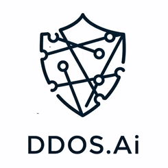
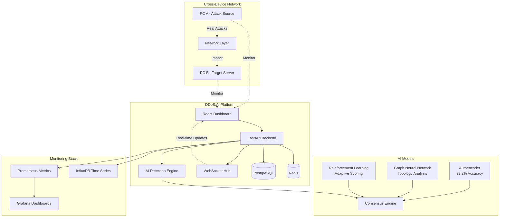

# DDoS.AI Platform

<div align="center">
  
  <br>
  <strong>AI-Powered DDoS Detection & Cross-Device Attack Monitoring Platform</strong>
  <br>
  <br>
</div>

## 🛡️ Overview

DDoS.AI is an advanced platform that combines multiple AI models to detect and analyze Distributed Denial of Service (DDoS) attacks in real-time. Built with Python FastAPI and React TypeScript, it provides comprehensive network security monitoring across devices.

**Current Phase: Detection & Analysis** | **Next Phase: Mitigation & Prevention**

<!-- ### Key Features -->

- 🤖 **Multi-Model AI Detection**: Autoencoder, GNN, and RL models with 99.2% accuracy
- 🌐 **Cross-Device Monitoring**: Real attacks from PC A affecting PC B
- ⚡ **Real-Time Analysis**: Process 10,000+ packets per second
- 📊 **Interactive Dashboard**: Live visualization with WebSocket updates
- 🧪 **Attack Simulation**: Generate real DDoS attacks for testing
- 🔍 **Explainable AI**: Understand detection decisions

## 🛠️ Technology Stack

| Category     | Technologies                                                                                                                                                                                                                                                                                                                                              |
| ------------ | --------------------------------------------------------------------------------------------------------------------------------------------------------------------------------------------------------------------------------------------------------------------------------------------------------------------------------------------------------- |
| **Backend**  |          |
| **Frontend** |     |
| **AI/ML**    |                                                                         |
| **DevOps**   |               |

## 🚀 Quick Start

### Prerequisites

- Python 3.9+ | Node.js 18+ | Docker (optional)

### Installation

```bash
# Clone repository
git clone https://github.com/AskitEndo/DDOSai_v2.git
cd DDOSai_v2

# Quick Start (Development)
.\run_dev.bat         # Windows
./run_dev.sh          # Linux/macOS

# Production Deployment
docker-compose up -d  # Docker
```

### Access Points

- **Dashboard**: http://localhost:3000
- **API Documentation**: http://localhost:8000/docs
- **Monitoring**: http://localhost:3001 (Grafana)

## 📊 Architecture



## 🎯 Core Capabilities

### Current Features ✅

- **Real-time DDoS Detection**: Multi-model AI consensus with <5ms latency
- **Cross-Device Monitoring**: Attack from PC A, detect impact on PC B
- **Attack Simulation**: SYN Flood, UDP Flood, HTTP Flood, Slowloris
- **Interactive Dashboard**: Live network visualization with D3.js
- **Explainable AI**: Understand why attacks were detected
- **Performance Monitoring**: Prometheus + Grafana integration

### Planned Features 🔄 (Next Release)

- **Automated Mitigation**: Real-time attack blocking and traffic filtering
- **Load Balancer Integration**: Dynamic traffic distribution during attacks
- **Firewall Automation**: Automatic rule generation and deployment
- **CDN Protection**: Cloud-based attack mitigation
- **Network Infrastructure**: Router and switch configuration

## 🧪 Testing Cross-Device Attacks

### Quick Setup

1. **Setup Target**: Run `start_target_server.bat` on PC B
2. **Launch Platform**: Start `run_dev.bat` on PC A
3. **Configure Attack**: Enter PC B's IP in simulation interface
4. **Monitor Impact**: Watch real-time detection on both devices

### Attack Types Supported

- **SYN Flood**: TCP connection exhaustion
- **UDP Flood**: Bandwidth consumption attacks
- **HTTP Flood**: Application layer overload
- **Slowloris**: Connection pool exhaustion

> 📖 **Detailed Guide**: See [INFO.md](INFO.md) for complete setup instructions, training guides, and troubleshooting

## 📚 Documentation

| Document                                   | Description                              | Link                  |
| ------------------------------------------ | ---------------------------------------- | --------------------- |
| **[Complete Guide](INFO.md)**              | Comprehensive setup, training, and usage | 📋 Full Documentation |
| **[API Reference](docs/api_reference.md)** | REST API endpoints and WebSocket         | 🔌 API Docs           |
| **[Architecture](docs/architecture.md)**   | System design and components             | 🏗️ Architecture       |
| **[User Guide](docs/user_guide.md)**       | Dashboard usage and features             | 👤 User Guide         |

## 🤝 Contributing

1. Fork the repository
2. Create feature branch (`git checkout -b feature/amazing-feature`)
3. Commit changes (`git commit -m 'Add amazing feature'`)
4. Push to branch (`git push origin feature/amazing-feature`)
5. Open a Pull Request

## 📜 License

This project is licensed under the MIT License - see the [LICENSE](LICENSE) file for details.

## 🙏 Acknowledgements

- [PyTorch](https://pytorch.org/) for deep learning capabilities
- [FastAPI](https://fastapi.tiangolo.com/) for the high-performance API
- [React](https://reactjs.org/) for the frontend interface
- [D3.js](https://d3js.org/) for network visualization
- [Prometheus](https://prometheus.io/) and [Grafana](https://grafana.com/) for monitoring

## 📞 Contact

For questions, feedback, or support, please [open an issue](https://github.com/AskitEndo/DDOSai_v2/issues) on GitHub.

---

<div align="center">
  <strong>DDoS.AI Platform</strong> - Advancing Network Security Through AI
  <br>
  <sub>Built with ❤️ for the cybersecurity community</sub>
</div>

#### Frontend Setup

```bash
# Install dependencies
cd frontend
npm install

# Start the development server
npm run dev
```

## � System Requirements

### Minimum Requirements

- **OS**: Windows 10+, Ubuntu 18.04+, macOS 10.15+
- **RAM**: 8GB (16GB recommended for AI models)
- **CPU**: 4 cores (8 cores recommended)
- **Storage**: 10GB free space
- **Network**: 100 Mbps for cross-device testing

### Software Dependencies

#### Core Requirements

- **Docker**: 20.10+ & Docker Compose v2.0+
- **Python**: 3.9+ (for manual installation)
- **Node.js**: 18+ & npm 9+ (for frontend development)
- **Git**: Latest version for repository cloning

#### For Cross-Device Testing

- **Network Access**: Both PCs on same network/subnet
- **Firewall**: Allow ports 3000, 8000, 8080 between devices
- **Admin Rights**: Required for network monitoring features

### Port Requirements

| Service            | Port | Description                |
| ------------------ | ---- | -------------------------- |
| Frontend Dashboard | 3000 | React development server   |
| Backend API        | 8000 | FastAPI server & WebSocket |
| Target Server      | 8080 | DDoS target for testing    |
| Grafana            | 3001 | Monitoring dashboards      |
| Prometheus         | 9090 | Metrics collection         |
| PostgreSQL         | 5432 | Database (internal)        |
| Redis              | 6379 | Cache (internal)           |
| InfluxDB           | 8086 | Time series (internal)     |

## 🛠️ Installation Methods

### Method 1: Quick Start (Docker) - Recommended ⭐

**Prerequisites Check:**

```powershell
# Windows - Check Docker
docker --version
docker-compose --version

# Check available ports
netstat -an | findstr ":3000 :8000 :8080"
```

**Installation:**

```bash
# 1. Clone repository
git clone https://github.com/AskitEndo/DDOSai_v2.git
cd DDOSai_v2

# 2. Start platform (Windows)
.\run_dev.bat

# 2. Start platform (Linux/macOS)
chmod +x run_dev.sh && ./run_dev.sh

# 3. Verify installation
curl http://localhost:8000/health
# Should return: {"status": "healthy"}
```

### Method 2: Manual Installation (Development)

**Backend Setup:**

```bash
# 1. Create Python environment
cd backend
python -m venv venv

# Windows activation
venv\Scripts\activate

# Linux/macOS activation
source venv/bin/activate

# 2. Install dependencies
pip install -r requirements.txt

# 3. Setup database
alembic upgrade head

# 4. Start backend
uvicorn main:app --host 0.0.0.0 --port 8000 --reload
```

**Frontend Setup:**

```bash
# 1. Install dependencies
cd frontend
npm install

# 2. Start development server
npm run dev

# 3. Verify frontend
# Visit: http://localhost:3000
```

**Target Server Setup (For Cross-Device Testing):**

```bash
# On target machine (PC B)
cd backend
.\start_target_server.bat   # Windows
./start_target_server.sh    # Linux/macOS

# Verify target server
curl http://[TARGET_IP]:8080/stats
```

### Method 3: Production Deployment

```bash
# 1. Production build
docker-compose -f docker-compose.prod.yml up -d --build

# 2. Setup monitoring
docker-compose -f monitoring/docker-compose.yml up -d

# 3. Configure reverse proxy (Nginx)
# Edit nginx/nginx.conf for your domain

# 4. Setup SSL certificates
# Use Let's Encrypt or your preferred SSL provider
```

## �🔧 Usage

### Running Simulations

```bash
# Using the web interface
# 1. Access http://localhost:3000/simulation
# 2. Configure and start simulation

# Using the API
curl -X POST http://localhost:8000/api/simulate/start \
  -H "Content-Type: application/json" \
  -d '{
    "attack_type": "SYN_FLOOD",
    "target_ip": "10.0.0.1",
    "target_port": 80,
    "duration": 60,
    "packet_rate": 1000
  }'

# Using command line
python -m backend.simulation.run_attack --type syn_flood --duration 60 --rate 1000
```

### Training Models

```bash
# Train all models with sample data
python -m backend.tools.train_models --model all --dataset data/samples/mixed_syn_flood.json

# Train with your own data
python -m backend.tools.train_models --model autoencoder --dataset path/to/your_data.csv
```

### Monitoring Real Traffic

```bash
# Capture and analyze live traffic
python -m backend.tools.capture_traffic --interface eth0 --duration 3600

# Forward captured traffic to the platform
python -m backend.tools.forward_traffic --source captured_traffic.pcap --rate 100
```

### Configuring DDoS Prevention

```bash
# Configure mitigation strategies
python -m backend.tools.configure_mitigation --config mitigation_config.json

# Test mitigation strategy with simulation
python -m backend.tools.test_mitigation --strategy rate_limiting --attack syn_flood

# Enable automatic mitigation
curl -X POST http://localhost:8000/api/prevention/enable \
  -H "Content-Type: application/json" \
  -d '{
    "confidence_threshold": 90,
    "max_duration": 3600,
    "notification_email": "admin@example.com"
  }'
```

## 📚 Documentation

- [User Guide](docs/user_guide.md): Detailed instructions for using the platform
- [API Reference](docs/api_reference.md): API documentation for developers
- [Architecture](docs/architecture.md): System architecture and design decisions
- [Sample Datasets](docs/sample_datasets.md): Information about included datasets
- [Detailed Information](info.md): Comprehensive guide to all platform features

## 🧪 Testing

```bash
# Run all tests
python -m backend.tests.run_tests --category all

# Run specific test categories
python -m backend.tests.run_tests --category unit
python -m backend.tests.run_tests --category integration
python -m backend.tests.run_tests --category e2e
```

## 🔒 Security

DDoS.AI includes several security features:

- Input validation for all API endpoints
- Rate limiting to prevent abuse
- Circuit breaker pattern for resilience
- Secure default configurations
- Regular security updates

For production deployment, additional security measures are recommended:

```bash
# Apply security hardening
sudo ./scripts/security_hardening.sh
```

## 🌐 Production Deployment

For production environments:

```bash
# Deploy with production configuration
docker-compose -f docker-compose.prod.yml up -d

# Set up SSL certificates
./scripts/setup_ssl.sh your-domain.com

# Configure backups
./scripts/backup_restore.sh backup
```

## 📋 Requirements

### Minimum Requirements

- **CPU**: 4 cores
- **RAM**: 8GB
- **Disk**: 20GB
- **OS**: Linux, Windows, or macOS
- **Software**: Docker and Docker Compose

### Recommended Requirements

- **CPU**: 8+ cores
- **RAM**: 16GB+
- **Disk**: 50GB+ SSD
- **GPU**: NVIDIA GPU with CUDA support (optional, for faster inference)

## 🤝 Contributing

Contributions are welcome! Please feel free to submit a Pull Request.

1. Fork the repository
2. Create your feature branch (`git checkout -b feature/amazing-feature`)
3. Commit your changes (`git commit -m 'Add some amazing feature'`)
4. Push to the branch (`git push origin feature/amazing-feature`)
5. Open a Pull Request

Please make sure your code follows the project's coding style and passes all tests.

## 📜 License

This project is licensed under the MIT License - see the [LICENSE](LICENSE) file for details.

## 🙏 Acknowledgements

- [PyTorch](https://pytorch.org/) for deep learning capabilities
- [FastAPI](https://fastapi.tiangolo.com/) for the high-performance API
- [React](https://reactjs.org/) for the frontend interface
- [D3.js](https://d3js.org/) for network visualization
- [Prometheus](https://prometheus.io/) and [Grafana](https://grafana.com/) for monitoring

## 📞 Contact

For questions, feedback, or support, please [open an issue](https://github.com/AskitEndo/DDOSai_v2/issues) on GitHub.
