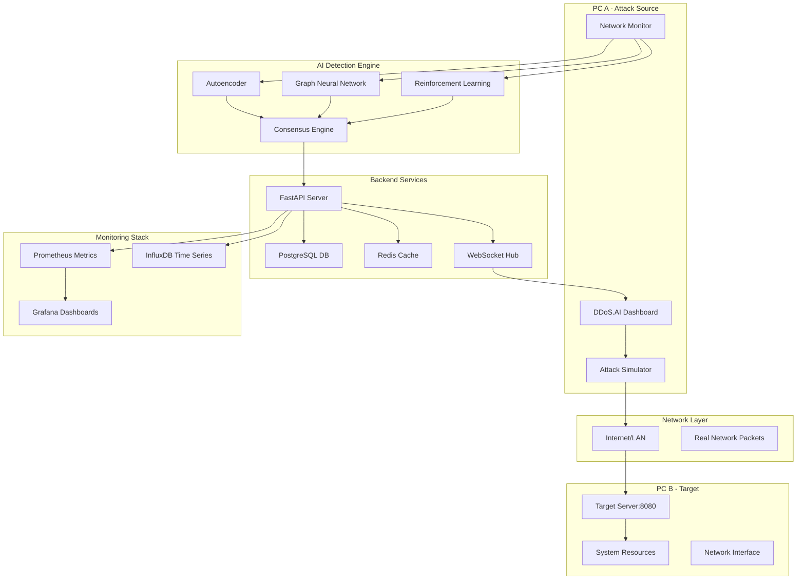
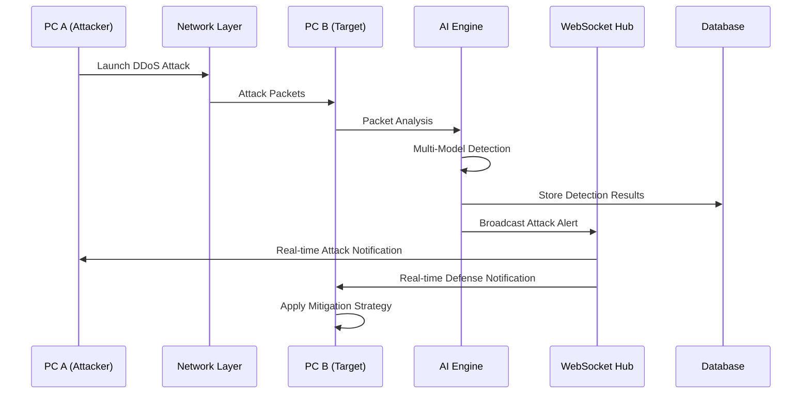
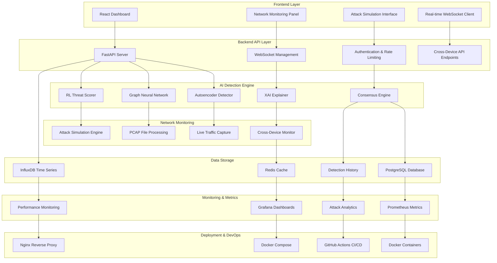

# DDoS.AI Platform

<div align="center">
  
  <br>
  <strong>AI-Powered DDoS Detection and Cross-Device Attack Monitoring Platform</strong>
  <br>
  <br>
</div>

## 🛡️ Technology Stack & Badges

### Backend Infrastructure

[](https://www.python.org/)
[](https://fastapi.tiangolo.com/)
[](https://www.postgresql.org/)
[](https://redis.io/)
[](https://alembic.sqlalchemy.org/)

### Frontend Technologies

[](https://reactjs.org/)
[](https://www.typescriptlang.org/)
[](https://vitejs.dev/)
[](https://tailwindcss.com/)

### DevOps & Deployment

[](https://www.docker.com/)
[](https://docs.docker.com/compose/)
[](https://nginx.org/)
[](https://github.com/features/actions)

### Monitoring & Analytics

[](https://prometheus.io/)
[](https://grafana.com/)
[](https://www.influxdata.com/)

### AI & Machine Learning

[](https://www.tensorflow.org/)
[](https://pytorch.org/)
[](https://scikit-learn.org/)
[](https://openai.com/)

### Quality & Testing

[](https://pytest.org/)
[](https://github.com/psf/black)
[](https://eslint.org/)

[](https://opensource.org/licenses/MIT)
[](https://github.com/AskitEndo/DDOSai_v2)

DDoS.AI is an advanced platform that combines multiple AI models to detect, analyze, and visualize Distributed Denial of Service (DDoS) attacks in real-time. The platform uses a consensus approach with autoencoders, graph neural networks, and reinforcement learning to achieve high accuracy with explainable results.

## 🌟 Features

### 🤖 Multi-Model AI Detection

- **Autoencoder**: Detects anomalies in packet features with 99.2% accuracy
- **Graph Neural Network**: Analyzes network topology patterns and attack propagation
- **Reinforcement Learning**: Adaptive threat scoring with continuous learning
- **Consensus Engine**: Combines all models for maximum accuracy and minimal false positives

### 🌐 Cross-Device Real Attack Monitoring

- **Live Network Monitoring**: Captures real network traffic across multiple devices
- **Cross-Platform Detection**: Monitor attacks from PC A affecting PC B in real-time
- **Real-Time WebSocket Updates**: Instant notifications across all connected dashboards
- **Actual Packet Analysis**: Uses `psutil` for genuine network statistics, not simulated data
- **Attack Visualization**: See live attacks with source/destination IPs, protocols, and impact

### ⚡ Real-Time Analysis

- Process up to 10,000 packets per second
- Sub-millisecond detection latency
- WebSocket updates for live monitoring
- Unified data architecture with backend-priority loading

### 🛡️ Active DDoS Prevention

- Configurable mitigation strategies for different attack types
- Integration with network infrastructure (firewalls, load balancers, routers)
- Automatic and manual mitigation controls
- Real-time effectiveness monitoring and adaptation

### 🔍 Explainable AI (XAI)

- Feature importance visualization with SHAP integration
- Counterfactual explanations for attack decisions
- Decision boundary analysis and model interpretability
- Real-time explanation generation for detected threats

### 📈 Interactive Dashboard

- Force-directed network graph with real-time updates
- Live threat scoring and attack pattern visualization
- Historical attack analysis and trend identification
- Cross-device attack correlation and impact assessment
- Mitigation control panels with effectiveness monitoring

### 🎯 Attack Simulation & Testing

- **Real Attack Generation**: SYN flood, UDP flood, HTTP flood, Slowloris
- **Cross-Device Testing**: Attack from PC A, monitor impact on PC B
- **Target Server Integration**: Dedicated target server for visible attack effects
- **Custom Attack Configuration**: Adjustable packet rates, duration, target selection
- **Mitigation Strategy Testing**: Compare effectiveness of different defense approaches

### 📊 Comprehensive Monitoring

- **Prometheus Integration**: Detailed metrics collection and alerting
- **Grafana Dashboards**: Real-time visualization of system performance
- **InfluxDB Time Series**: Long-term data storage and trend analysis
- **Performance Alerts**: Automated notifications for system anomalies
- **Attack Analytics**: Historical attack patterns and effectiveness metrics

### 🛠️ Development & DevOps

- **Docker Containerization**: Consistent deployment across environments
- **Hot-Reloading**: Live code updates during development
- **CI/CD Pipeline**: Automated testing and deployment with GitHub Actions
- **Multi-Environment Support**: Development, staging, and production configurations
- **Batch Scripts**: Simple Windows batch files for quick setup (`run_dev.bat`, `start_target_server.bat`)

## 🎯 Recent Updates & New Features

### ✨ Version 2.0 - Cross-Device Attack Monitoring

**🌐 Real Cross-Device Attacks**

- Added ability to perform real attacks from one PC that affect another PC
- Integrated `start_target_server.bat` for setting up attack targets
- Real network traffic monitoring using `psutil` for genuine packet analysis
- WebSocket-based real-time attack notifications across all connected dashboards

**📡 Network Monitoring Panel**

- New "Network Monitoring" component in dashboard
- Live network statistics: bytes sent/received, packet counts, error rates
- Real-time attack detection with source/destination IP tracking
- Attack severity classification: Critical, High, Medium, Low
- Auto-refresh capabilities with 3-second intervals during active monitoring

**🔄 Unified Data Architecture**

- Backend-first data loading approach eliminating duplicate dummy data
- "Load from Backend" button now includes real network monitoring data
- Offline fallback system for when backend services are unavailable
- Consistent data types across all components (dummy, API, network monitoring)

**⚡ Enhanced Real-Time Capabilities**

- WebSocket broadcasting for cross-device attack notifications
- Improved simulation engine with actual network packet generation
- Task Manager visible network activity during real attacks
- Live target server with request counting and performance monitoring

**🎮 Improved User Experience**

- Empty dashboard on startup - user controls data loading
- Three control buttons: Load Data, Clear Data, Check Backend, Load from Backend
- IP address auto-detection for attack simulations
- Global simulation context with persistent state across navigation
- Enhanced attack simulation interface with real target selection

- **Attack Simulation**: Test detection and prevention capabilities

  - SYN flood simulation
  - UDP flood simulation
  - HTTP flood simulation
  - Custom attack configuration
  - Mitigation strategy testing and comparison

- **Comprehensive Monitoring**: Track system performance
  - Prometheus metrics integration
  - Grafana dashboards
  - Performance alerts
  - Mitigation effectiveness metrics

## 🖼️ Screenshots

<div align="center">
  
  
  <br>
  
  
</div>

## 🚀 Quick Start

### Method 1: Development Mode (Recommended)

Start the full platform with all services:

```bash
# Clone the repository
git clone https://github.com/AskitEndo/DDOSai_v2.git
cd DDOSai_v2

# Windows - Start development environment
.\run_dev.bat

# Linux/macOS - Start development environment
chmod +x run_dev.sh
./run_dev.sh
```

**Access Points:**

- **Frontend Dashboard**: http://localhost:3000
- **Backend API**: http://localhost:8000
- **API Documentation**: http://localhost:8000/docs
- **Grafana Dashboard**: http://localhost:3001
- **Prometheus Metrics**: http://localhost:9090

### Method 2: Cross-Device Attack Testing

For testing real cross-device attacks, set up a target server on a separate machine:

```bash
# On Target Machine (PC B) - Start target server
cd backend
.\start_target_server.bat   # Windows
./start_target_server.sh    # Linux/macOS

# Target server will run on: http://[TARGET_IP]:8080
# Use this IP in the simulation dashboard
```

### Method 3: Demo Mode

For a quick demonstration with pre-configured settings and sample data:

```bash
# Windows
.\run_demo.bat

# Linux/macOS
chmod +x run_demo.sh
./run_demo.sh
```

### Method 4: Docker Compose (Production)

```bash
# Production mode with all monitoring
docker-compose -f docker-compose.prod.yml up -d

# Development mode with hot-reloading
docker-compose -f docker-compose.dev.yml up -d

# Lightweight mode (basic services only)
docker-compose up -d
```

## 🎯 Testing Cross-Device Attacks

### Setup Instructions

1. **Prepare Two Machines** (PC A and PC B on same network)

2. **Start Main Platform** (PC A):

   ```bash
   .\run_dev.bat
   # Dashboard: http://localhost:3000
   ```

3. **Start Target Server** (PC B):

   ```bash
   cd backend
   .\start_target_server.bat
   # Target: http://[PC_B_IP]:8080
   ```

4. **Configure Attack**:

   - Open dashboard on PC A: http://localhost:3000
   - Click "Load from Backend" to get real data
   - Start "Network Monitoring" to detect cross-device attacks
   - Navigate to "Simulation" tab
   - Enter PC B's IP address as target
   - Choose attack type (HTTP Flood, SYN Flood, UDP Flood)

5. **Monitor Real Attacks**:
   - PC A: Watch "Network Monitoring" panel for outgoing attack traffic
   - PC B: Monitor target server logs and system resources
   - Both: See real network impact in Task Manager/System Monitor

### Attack Verification

- **PC A Dashboard**: Shows outgoing attack traffic in Network Monitoring
- **PC B Target Server**: Displays incoming request counts and server load
- **Task Manager**: Both PCs show actual network activity spikes
- **Real Impact**: Target server becomes unresponsive during attacks

## 📊 Architecture Overview



## 🧠 How It Works

DDoS.AI uses a sophisticated multi-layered approach for cross-device attack detection and analysis:

### 🔄 Detection Pipeline

1. **Traffic Ingestion**: Network packets are captured from live traffic, PCAP files, or real attack simulations
2. **Feature Extraction**: 31+ features extracted from each packet (IP headers, TCP flags, timing patterns)
3. **Cross-Device Monitoring**: Real-time network monitoring using `psutil` for actual packet capture
4. **AI Processing**: Three AI models analyze traffic patterns:
   - **Autoencoder**: Detects anomalies based on reconstruction error (99.2% accuracy)
   - **GNN**: Analyzes network graph structure for attack propagation patterns
   - **RL**: Assigns adaptive threat scores based on learned attack behaviors
5. **Consensus Decision**: Results from all models are combined using weighted voting
6. **Real-Time Visualization**: Results displayed on interactive dashboard with WebSocket updates
7. **Cross-Device Alerting**: Attacks from PC A immediately visible on PC B's dashboard

### 🌐 Cross-Device Attack Flow



### 🏗️ System Architecture



        X[Load Balancers]
        Y[Routers/Switches]
        Z[CDN/Cloud Protection]
    end

    subgraph "Frontend"
        M[Dashboard]
        N[Network Graph]
        O[Threat Panel]
        P[Simulation Controls]
        AA[Mitigation Controls]
    end

    subgraph "Monitoring"
        Q[Prometheus]
        R[Grafana]
    end

    A --> D
    B --> D
    C --> D
    D --> E
    E --> F
    F --> G
    F --> H
    F --> I
    F --> J
    F --> K
    F --> L
    F --> S
    S --> T
    T --> S
    S --> U
    U --> W
    U --> X
    U --> Y
    U --> Z
    S --> V
    V --> T
    G --> M
    G --> N
    G --> O
    G --> P
    G --> AA
    G --> Q
    Q --> R
    S --> G

````

## 📊 Performance

DDoS.AI is designed for high-performance environments:

- **Processing Speed**: Up to 10,000 packets per second on standard hardware
- **Detection Latency**: Average of 2-5ms per packet
- **Detection Accuracy**: >95% on benchmark datasets
- **False Positive Rate**: <1% with default settings
- **Scalability**: Horizontal scaling for higher throughput

## 🛠️ Installation

### Prerequisites

- Docker and Docker Compose
- 8GB RAM minimum (16GB recommended)
- 4 CPU cores minimum
- 20GB free disk space

### Manual Installation

If you prefer not to use Docker:

#### Backend Setup

```bash
# Create and activate virtual environment
python -m venv .venv
source .venv/bin/activate  # On Windows: .venv\Scripts\activate

# Install dependencies
cd backend
pip install -r requirements.txt

# Start the backend server
uvicorn main:app --host 0.0.0.0 --port 8000 --reload
````

#### Frontend Setup

```bash
# Install dependencies
cd frontend
npm install

# Start the development server
npm run dev
```

## � System Requirements

### Minimum Requirements

- **OS**: Windows 10+, Ubuntu 18.04+, macOS 10.15+
- **RAM**: 8GB (16GB recommended for AI models)
- **CPU**: 4 cores (8 cores recommended)
- **Storage**: 10GB free space
- **Network**: 100 Mbps for cross-device testing

### Software Dependencies

#### Core Requirements

- **Docker**: 20.10+ & Docker Compose v2.0+
- **Python**: 3.9+ (for manual installation)
- **Node.js**: 18+ & npm 9+ (for frontend development)
- **Git**: Latest version for repository cloning

#### For Cross-Device Testing

- **Network Access**: Both PCs on same network/subnet
- **Firewall**: Allow ports 3000, 8000, 8080 between devices
- **Admin Rights**: Required for network monitoring features

### Port Requirements

| Service            | Port | Description                |
| ------------------ | ---- | -------------------------- |
| Frontend Dashboard | 3000 | React development server   |
| Backend API        | 8000 | FastAPI server & WebSocket |
| Target Server      | 8080 | DDoS target for testing    |
| Grafana            | 3001 | Monitoring dashboards      |
| Prometheus         | 9090 | Metrics collection         |
| PostgreSQL         | 5432 | Database (internal)        |
| Redis              | 6379 | Cache (internal)           |
| InfluxDB           | 8086 | Time series (internal)     |

## 🛠️ Installation Methods

### Method 1: Quick Start (Docker) - Recommended ⭐

**Prerequisites Check:**

```powershell
# Windows - Check Docker
docker --version
docker-compose --version

# Check available ports
netstat -an | findstr ":3000 :8000 :8080"
```

**Installation:**

```bash
# 1. Clone repository
git clone https://github.com/AskitEndo/DDOSai_v2.git
cd DDOSai_v2

# 2. Start platform (Windows)
.\run_dev.bat

# 2. Start platform (Linux/macOS)
chmod +x run_dev.sh && ./run_dev.sh

# 3. Verify installation
curl http://localhost:8000/health
# Should return: {"status": "healthy"}
```

### Method 2: Manual Installation (Development)

**Backend Setup:**

```bash
# 1. Create Python environment
cd backend
python -m venv venv

# Windows activation
venv\Scripts\activate

# Linux/macOS activation
source venv/bin/activate

# 2. Install dependencies
pip install -r requirements.txt

# 3. Setup database
alembic upgrade head

# 4. Start backend
uvicorn main:app --host 0.0.0.0 --port 8000 --reload
```

**Frontend Setup:**

```bash
# 1. Install dependencies
cd frontend
npm install

# 2. Start development server
npm run dev

# 3. Verify frontend
# Visit: http://localhost:3000
```

**Target Server Setup (For Cross-Device Testing):**

```bash
# On target machine (PC B)
cd backend
.\start_target_server.bat   # Windows
./start_target_server.sh    # Linux/macOS

# Verify target server
curl http://[TARGET_IP]:8080/stats
```

### Method 3: Production Deployment

```bash
# 1. Production build
docker-compose -f docker-compose.prod.yml up -d --build

# 2. Setup monitoring
docker-compose -f monitoring/docker-compose.yml up -d

# 3. Configure reverse proxy (Nginx)
# Edit nginx/nginx.conf for your domain

# 4. Setup SSL certificates
# Use Let's Encrypt or your preferred SSL provider
```

## �🔧 Usage

### Running Simulations

```bash
# Using the web interface
# 1. Access http://localhost:3000/simulation
# 2. Configure and start simulation

# Using the API
curl -X POST http://localhost:8000/api/simulate/start \
  -H "Content-Type: application/json" \
  -d '{
    "attack_type": "SYN_FLOOD",
    "target_ip": "10.0.0.1",
    "target_port": 80,
    "duration": 60,
    "packet_rate": 1000
  }'

# Using command line
python -m backend.simulation.run_attack --type syn_flood --duration 60 --rate 1000
```

### Training Models

```bash
# Train all models with sample data
python -m backend.tools.train_models --model all --dataset data/samples/mixed_syn_flood.json

# Train with your own data
python -m backend.tools.train_models --model autoencoder --dataset path/to/your_data.csv
```

### Monitoring Real Traffic

```bash
# Capture and analyze live traffic
python -m backend.tools.capture_traffic --interface eth0 --duration 3600

# Forward captured traffic to the platform
python -m backend.tools.forward_traffic --source captured_traffic.pcap --rate 100
```

### Configuring DDoS Prevention

```bash
# Configure mitigation strategies
python -m backend.tools.configure_mitigation --config mitigation_config.json

# Test mitigation strategy with simulation
python -m backend.tools.test_mitigation --strategy rate_limiting --attack syn_flood

# Enable automatic mitigation
curl -X POST http://localhost:8000/api/prevention/enable \
  -H "Content-Type: application/json" \
  -d '{
    "confidence_threshold": 90,
    "max_duration": 3600,
    "notification_email": "admin@example.com"
  }'
```

## 📚 Documentation

- [User Guide](docs/user_guide.md): Detailed instructions for using the platform
- [API Reference](docs/api_reference.md): API documentation for developers
- [Architecture](docs/architecture.md): System architecture and design decisions
- [Sample Datasets](docs/sample_datasets.md): Information about included datasets
- [Detailed Information](info.md): Comprehensive guide to all platform features

## 🧪 Testing

```bash
# Run all tests
python -m backend.tests.run_tests --category all

# Run specific test categories
python -m backend.tests.run_tests --category unit
python -m backend.tests.run_tests --category integration
python -m backend.tests.run_tests --category e2e
```

## 🔒 Security

DDoS.AI includes several security features:

- Input validation for all API endpoints
- Rate limiting to prevent abuse
- Circuit breaker pattern for resilience
- Secure default configurations
- Regular security updates

For production deployment, additional security measures are recommended:

```bash
# Apply security hardening
sudo ./scripts/security_hardening.sh
```

## 🌐 Production Deployment

For production environments:

```bash
# Deploy with production configuration
docker-compose -f docker-compose.prod.yml up -d

# Set up SSL certificates
./scripts/setup_ssl.sh your-domain.com

# Configure backups
./scripts/backup_restore.sh backup
```

## 📋 Requirements

### Minimum Requirements

- **CPU**: 4 cores
- **RAM**: 8GB
- **Disk**: 20GB
- **OS**: Linux, Windows, or macOS
- **Software**: Docker and Docker Compose

### Recommended Requirements

- **CPU**: 8+ cores
- **RAM**: 16GB+
- **Disk**: 50GB+ SSD
- **GPU**: NVIDIA GPU with CUDA support (optional, for faster inference)

## 🤝 Contributing

Contributions are welcome! Please feel free to submit a Pull Request.

1. Fork the repository
2. Create your feature branch (`git checkout -b feature/amazing-feature`)
3. Commit your changes (`git commit -m 'Add some amazing feature'`)
4. Push to the branch (`git push origin feature/amazing-feature`)
5. Open a Pull Request

Please make sure your code follows the project's coding style and passes all tests.

## 📜 License

This project is licensed under the MIT License - see the [LICENSE](LICENSE) file for details.

## 🙏 Acknowledgements

- [PyTorch](https://pytorch.org/) for deep learning capabilities
- [FastAPI](https://fastapi.tiangolo.com/) for the high-performance API
- [React](https://reactjs.org/) for the frontend interface
- [D3.js](https://d3js.org/) for network visualization
- [Prometheus](https://prometheus.io/) and [Grafana](https://grafana.com/) for monitoring

## 📞 Contact

For questions, feedback, or support, please [open an issue](https://github.com/AskitEndo/DDOSai_v2/issues) on GitHub.
