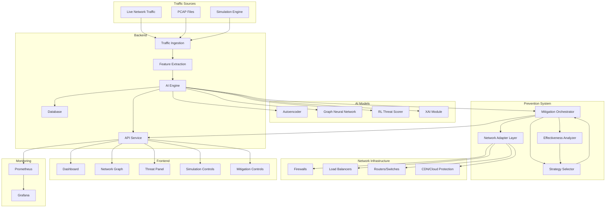

# DDoS.AI Platform

<div align="center">
  
  <br>
  <strong>AI-Powered DDoS Detection and Analysis Platform</strong>
  <br>
  <br>
</div>

[](https://opensource.org/licenses/MIT)
[](https://www.docker.com/)
[](https://www.python.org/)
[](https://reactjs.org/)
[](https://fastapi.tiangolo.com/)

DDoS.AI is an advanced platform that combines multiple AI models to detect, analyze, and visualize Distributed Denial of Service (DDoS) attacks in real-time. The platform uses a consensus approach with autoencoders, graph neural networks, and reinforcement learning to achieve high accuracy with explainable results.

## 🌟 Features

- **Multi-Model AI Detection**: Combines three AI approaches for high accuracy
  - **Autoencoder**: Detects anomalies in packet features
  - **Graph Neural Network**: Analyzes network topology patterns
  - **Reinforcement Learning**: Adaptive threat scoring
- **Real-Time Analysis**: Process network traffic as it happens

  - Process up to 10,000 packets per second
  - Sub-millisecond detection latency
  - WebSocket updates for live monitoring

- **Active DDoS Prevention**: Automatically mitigate detected attacks

  - Configurable mitigation strategies for different attack types
  - Integration with network infrastructure (firewalls, load balancers, routers)
  - Automatic and manual mitigation controls
  - Real-time effectiveness monitoring and adaptation

- **Explainable AI**: Understand why traffic was flagged

  - Feature importance visualization
  - Counterfactual explanations
  - Decision boundary analysis

- **Interactive Dashboard**: Visualize network activity

  - Force-directed network graph
  - Real-time threat scoring
  - Historical attack patterns
  - Mitigation control and status panels

- **Attack Simulation**: Test detection and prevention capabilities

  - SYN flood simulation
  - UDP flood simulation
  - HTTP flood simulation
  - Custom attack configuration
  - Mitigation strategy testing and comparison

- **Comprehensive Monitoring**: Track system performance
  - Prometheus metrics integration
  - Grafana dashboards
  - Performance alerts
  - Mitigation effectiveness metrics

## 🖼️ Screenshots

<div align="center">
  
  
  <br>
  
  
</div>

## 🚀 Quick Start

### Using Docker (Recommended)

```bash
# Clone the repository
git clone https://github.com/yourusername/ddosai-platform.git
cd ddosai-platform

# Start the platform
docker-compose up -d

# Access the dashboard at http://localhost:3000
```

### Demo Mode

For a quick demonstration with pre-configured settings and sample data:

```bash
# Windows
run_demo.bat

# Linux/macOS
chmod +x run_demo.sh
./run_demo.sh
```

## 🧠 How It Works

DDoS.AI uses a multi-layered approach to detect and analyze DDoS attacks:

1. **Traffic Ingestion**: Network packets are captured or simulated
2. **Feature Extraction**: 31 features are extracted from each packet
3. **AI Processing**: Three AI models analyze the traffic:
   - **Autoencoder**: Detects anomalies based on reconstruction error
   - **GNN**: Analyzes network graph structure for attack patterns
   - **RL**: Assigns threat scores based on learned patterns
4. **Consensus Decision**: Results from all models are combined
5. **Visualization**: Results are displayed on the interactive dashboard
6. **Alerting**: Notifications are sent for detected threats

### Architecture Diagram



## 📊 Performance

DDoS.AI is designed for high-performance environments:

- **Processing Speed**: Up to 10,000 packets per second on standard hardware
- **Detection Latency**: Average of 2-5ms per packet
- **Detection Accuracy**: >95% on benchmark datasets
- **False Positive Rate**: <1% with default settings
- **Scalability**: Horizontal scaling for higher throughput

## 🛠️ Installation

### Prerequisites

- Docker and Docker Compose
- 8GB RAM minimum (16GB recommended)
- 4 CPU cores minimum
- 20GB free disk space

### Manual Installation

If you prefer not to use Docker:

#### Backend Setup

```bash
# Create and activate virtual environment
python -m venv .venv
source .venv/bin/activate  # On Windows: .venv\Scripts\activate

# Install dependencies
cd backend
pip install -r requirements.txt

# Start the backend server
uvicorn main:app --host 0.0.0.0 --port 8000 --reload
```

#### Frontend Setup

```bash
# Install dependencies
cd frontend
npm install

# Start the development server
npm run dev
```

## 🔧 Usage

### Running Simulations

```bash
# Using the web interface
# 1. Access http://localhost:3000/simulation
# 2. Configure and start simulation

# Using the API
curl -X POST http://localhost:8000/api/simulate/start \
  -H "Content-Type: application/json" \
  -d '{
    "attack_type": "SYN_FLOOD",
    "target_ip": "10.0.0.1",
    "target_port": 80,
    "duration": 60,
    "packet_rate": 1000
  }'

# Using command line
python -m backend.simulation.run_attack --type syn_flood --duration 60 --rate 1000
```

### Training Models

```bash
# Train all models with sample data
python -m backend.tools.train_models --model all --dataset data/samples/mixed_syn_flood.json

# Train with your own data
python -m backend.tools.train_models --model autoencoder --dataset path/to/your_data.csv
```

### Monitoring Real Traffic

```bash
# Capture and analyze live traffic
python -m backend.tools.capture_traffic --interface eth0 --duration 3600

# Forward captured traffic to the platform
python -m backend.tools.forward_traffic --source captured_traffic.pcap --rate 100
```

### Configuring DDoS Prevention

```bash
# Configure mitigation strategies
python -m backend.tools.configure_mitigation --config mitigation_config.json

# Test mitigation strategy with simulation
python -m backend.tools.test_mitigation --strategy rate_limiting --attack syn_flood

# Enable automatic mitigation
curl -X POST http://localhost:8000/api/prevention/enable \
  -H "Content-Type: application/json" \
  -d '{
    "confidence_threshold": 90,
    "max_duration": 3600,
    "notification_email": "admin@example.com"
  }'
```

## 📚 Documentation

- [User Guide](docs/user_guide.md): Detailed instructions for using the platform
- [API Reference](docs/api_reference.md): API documentation for developers
- [Architecture](docs/architecture.md): System architecture and design decisions
- [Sample Datasets](docs/sample_datasets.md): Information about included datasets
- [Detailed Information](info.md): Comprehensive guide to all platform features

## 🧪 Testing

```bash
# Run all tests
python -m backend.tests.run_tests --category all

# Run specific test categories
python -m backend.tests.run_tests --category unit
python -m backend.tests.run_tests --category integration
python -m backend.tests.run_tests --category e2e
```

## 🔒 Security

DDoS.AI includes several security features:

- Input validation for all API endpoints
- Rate limiting to prevent abuse
- Circuit breaker pattern for resilience
- Secure default configurations
- Regular security updates

For production deployment, additional security measures are recommended:

```bash
# Apply security hardening
sudo ./scripts/security_hardening.sh
```

## 🌐 Production Deployment

For production environments:

```bash
# Deploy with production configuration
docker-compose -f docker-compose.prod.yml up -d

# Set up SSL certificates
./scripts/setup_ssl.sh your-domain.com

# Configure backups
./scripts/backup_restore.sh backup
```

## 📋 Requirements

### Minimum Requirements

- **CPU**: 4 cores
- **RAM**: 8GB
- **Disk**: 20GB
- **OS**: Linux, Windows, or macOS
- **Software**: Docker and Docker Compose

### Recommended Requirements

- **CPU**: 8+ cores
- **RAM**: 16GB+
- **Disk**: 50GB+ SSD
- **GPU**: NVIDIA GPU with CUDA support (optional, for faster inference)

## 🤝 Contributing

Contributions are welcome! Please feel free to submit a Pull Request.

1. Fork the repository
2. Create your feature branch (`git checkout -b feature/amazing-feature`)
3. Commit your changes (`git commit -m 'Add some amazing feature'`)
4. Push to the branch (`git push origin feature/amazing-feature`)
5. Open a Pull Request

Please make sure your code follows the project's coding style and passes all tests.

## 📜 License

This project is licensed under the MIT License - see the [LICENSE](LICENSE) file for details.

## 🙏 Acknowledgements

- [PyTorch](https://pytorch.org/) for deep learning capabilities
- [FastAPI](https://fastapi.tiangolo.com/) for the high-performance API
- [React](https://reactjs.org/) for the frontend interface
- [D3.js](https://d3js.org/) for network visualization
- [Prometheus](https://prometheus.io/) and [Grafana](https://grafana.com/) for monitoring

## 📞 Contact

For questions, feedback, or support, please [open an issue](https://github.com/yourusername/ddosai-platform/issues) on GitHub.
