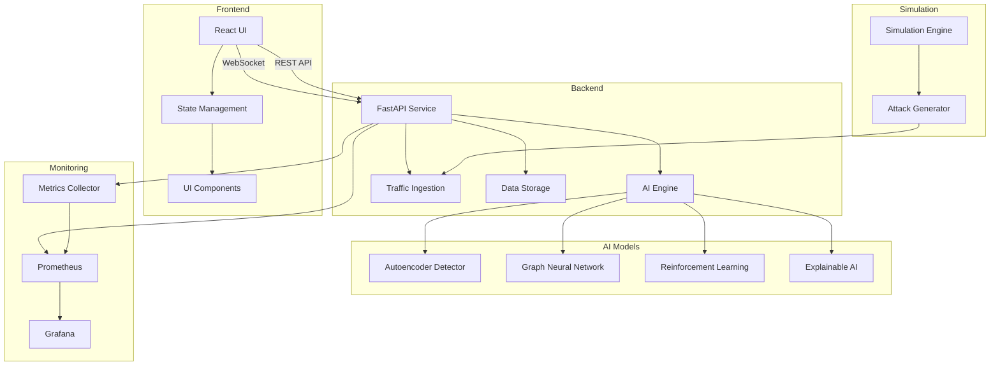
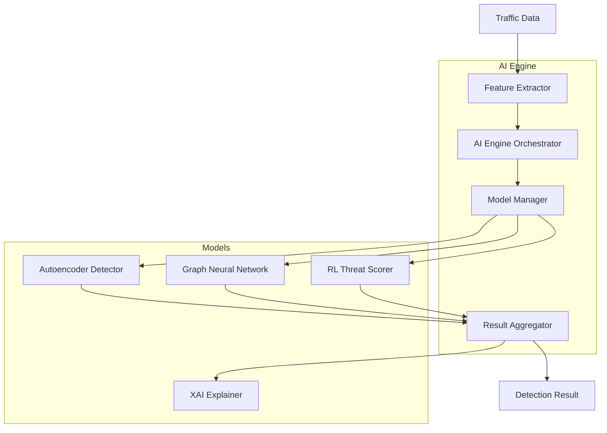
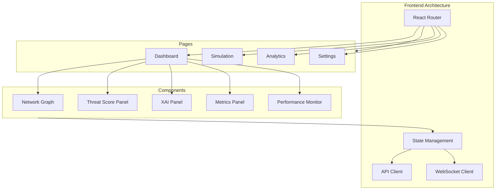
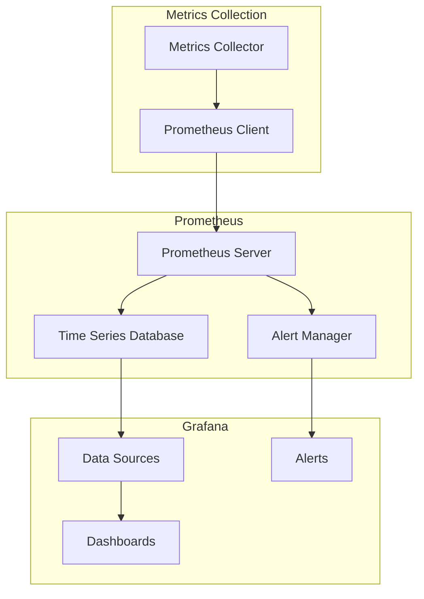
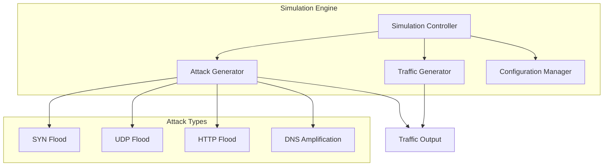
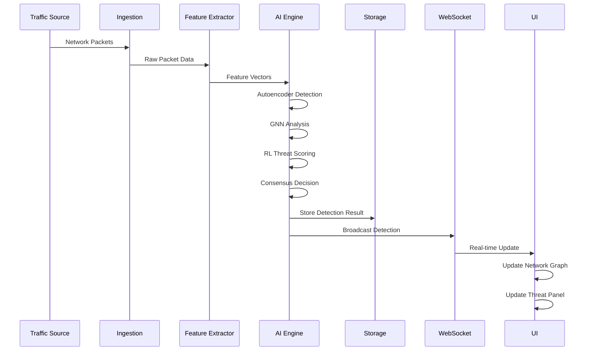
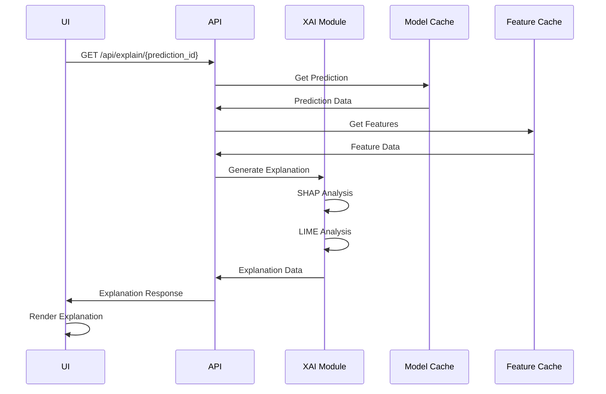
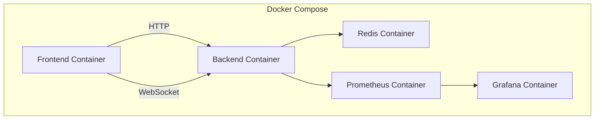
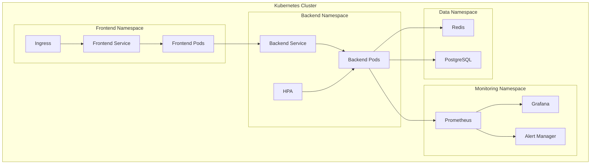
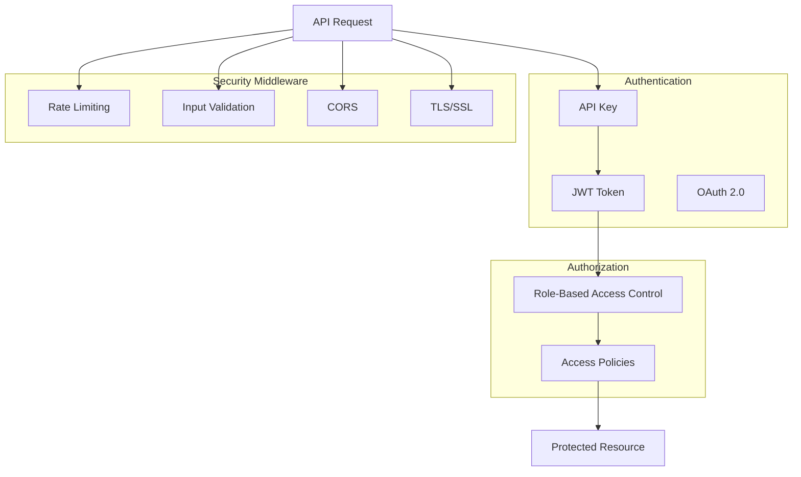

# DDoS.AI Architecture Documentation

This document provides a comprehensive overview of the DDoS.AI platform architecture, including system components, data flow, and design decisions.

## System Architecture Overview

DDoS.AI is built using a microservices architecture with the following main components:

1. **Backend API Service**: FastAPI-based REST and WebSocket API
2. **AI Engine**: Core detection and analysis components
3. **Frontend Application**: React-based user interface
4. **Monitoring System**: Prometheus and Grafana for metrics
5. **Simulation Engine**: Traffic and attack simulation

### Architecture Diagram

## Component Details

### Backend API Service

The backend API service is built using FastAPI, a modern, high-performance web framework for building APIs with Python. It provides both REST API endpoints and WebSocket connections for real-time updates.

#### Key Features

- Asynchronous request handling for high throughput
- WebSocket support for real-time updates
- Comprehensive error handling and validation
- Middleware for logging, rate limiting, and circuit breaking
- Health check and metrics endpoints

#### API Endpoints

The API provides the following main endpoints:

- `/api/analyze`: Analyze network packets for threats
- `/api/explain/{prediction_id}`: Get explanations for predictions
- `/api/detections`: Get recent detection results
- `/api/graph/current`: Get current network graph state
- `/api/metrics`: Get system performance metrics
- `/api/simulate/start`: Start attack simulation
- `/api/simulate/stop`: Stop attack simulation

### AI Engine

The AI Engine is the core of the DDoS.AI platform, responsible for analyzing network traffic and detecting threats. It orchestrates multiple AI models to achieve high accuracy and explainability.

#### Architecture

#### Model Details

1. **Autoencoder Detector**

   - Architecture: 64→32→16→32→64 neurons
   - Training: Unsupervised learning on normal traffic
   - Detection: Reconstruction error threshold
   - Purpose: Anomaly detection based on packet features

2. **Graph Neural Network (GNN) Analyzer**

   - Architecture: 2-layer Graph Convolutional Network
   - Training: Semi-supervised learning on labeled graphs
   - Detection: Node classification for malicious probability
   - Purpose: Network topology analysis and pattern detection

3. **Reinforcement Learning (RL) Threat Scorer**

   - Architecture: Deep Q-Network
   - Training: Reinforcement learning with rewards for accurate detection
   - Detection: Threat score assignment (0-100)
   - Purpose: Adaptive threat scoring based on context

4. **Explainable AI (XAI) Module**
   - Methods: SHAP and LIME integration
   - Purpose: Provide explanations for model decisions
   - Features: Feature importance, counterfactuals, decision boundaries

### Frontend Application

The frontend application is built using React with TypeScript, providing a responsive and interactive user interface for monitoring and analyzing network traffic.

#### Architecture

#### Key Components

1. **Dashboard**: Main monitoring view with real-time updates
2. **Network Graph**: D3.js-based visualization of network traffic
3. **Threat Score Panel**: Display of threat levels and recent detections
4. **XAI Panel**: Visualization of model explanations
5. **Metrics Panel**: Display of system performance metrics
6. **Performance Monitor**: Detailed system and model performance monitoring

### Monitoring System

The monitoring system is built using Prometheus and Grafana, providing comprehensive metrics collection and visualization.

#### Architecture

#### Metrics Collected

1. **System Metrics**

   - CPU usage
   - Memory usage
   - Disk usage
   - Network I/O

2. **Application Metrics**

   - Request count and rate
   - Response time
   - Error rate
   - Active connections

3. **AI Model Metrics**

   - Inference time
   - Accuracy
   - Confidence
   - Feature importance

4. **Traffic Metrics**
   - Packet count
   - Packet size distribution
   - Protocol distribution
   - Threat level

### Simulation Engine

The simulation engine allows for generating synthetic traffic and attacks for testing and training purposes.

#### Architecture

#### Simulation Capabilities

1. **Normal Traffic Generation**

   - Web browsing patterns
   - DNS queries
   - SSH sessions
   - Email traffic

2. **Attack Simulation**

   - SYN flood
   - UDP flood
   - HTTP flood
   - DNS amplification
   - NTP amplification

3. **Configuration Options**
   - Traffic rate
   - Attack duration
   - Target selection
   - Packet characteristics

## Data Flow

### Traffic Analysis Flow

### Explanation Request Flow

## Deployment Architecture

DDoS.AI can be deployed in various configurations depending on the requirements. Here are the main deployment options:

### Docker Compose Deployment

### Kubernetes Deployment

## Security Architecture

DDoS.AI implements multiple layers of security to protect the system and data:

### Authentication and Authorization

### Data Protection

1. **In Transit**: TLS/SSL encryption for all API communications
2. **At Rest**: Encrypted storage for sensitive data
3. **Input Validation**: Comprehensive validation of all API inputs
4. **Output Sanitization**: Proper encoding of all API responses

## Performance Considerations

### Scalability

The DDoS.AI platform is designed to scale horizontally to handle increasing traffic loads:

1. **Stateless Backend**: The backend API is stateless, allowing for easy scaling
2. **Redis Caching**: Redis is used for caching and session management
3. **Batch Processing**: AI models support batch processing for efficient inference
4. **Async Processing**: Asynchronous processing for non-blocking operations

### Performance Optimization

1. **Model Optimization**: AI models are optimized for inference speed
2. **Circuit Breaker**: Circuit breaker pattern for handling failures
3. **Connection Pooling**: Database and Redis connection pooling
4. **Efficient Data Structures**: Optimized data structures for memory efficiency

## Design Decisions

### Technology Stack Selection

1. **FastAPI**: Chosen for its high performance, async support, and automatic documentation
2. **React**: Chosen for its component-based architecture and efficient rendering
3. **PyTorch**: Chosen for its flexibility and support for custom neural network architectures
4. **Prometheus**: Chosen for its scalable metrics collection and alerting capabilities

### AI Model Selection

1. **Autoencoder**: Chosen for its ability to detect anomalies in high-dimensional data
2. **Graph Neural Network**: Chosen for its ability to analyze network topology
3. **Reinforcement Learning**: Chosen for its adaptive learning capabilities
4. **SHAP/LIME**: Chosen for their ability to explain complex model decisions

## Future Enhancements

1. **Federated Learning**: Implement federated learning for collaborative model training
2. **Transfer Learning**: Implement transfer learning for faster model adaptation
3. **Automated Model Retraining**: Implement automated retraining based on performance metrics
4. **Advanced Visualization**: Enhance visualization capabilities with 3D network graphs
5. **Integration with SIEM**: Integrate with Security Information and Event Management systems
